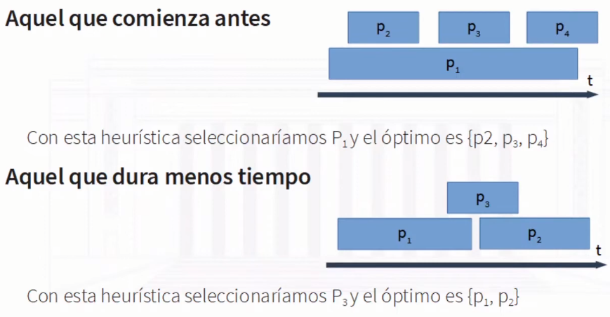
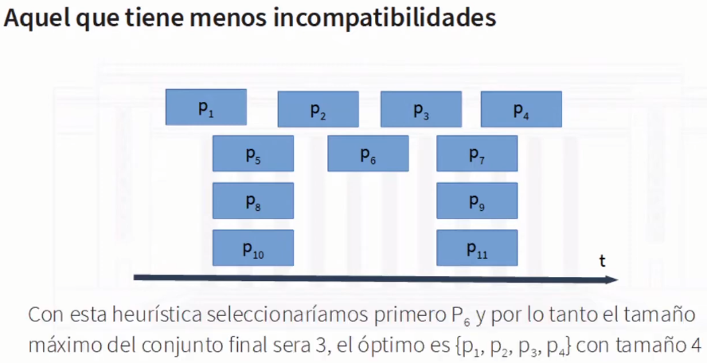
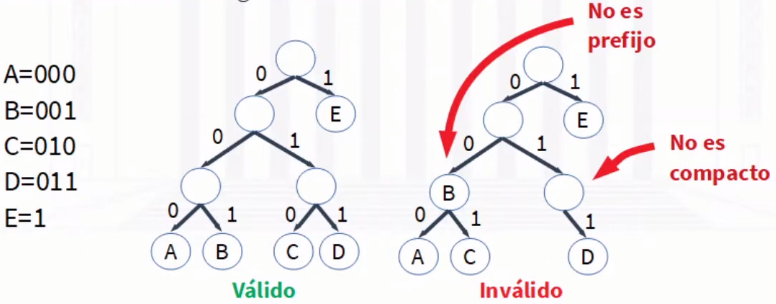
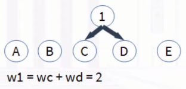
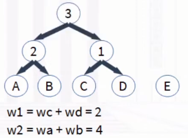
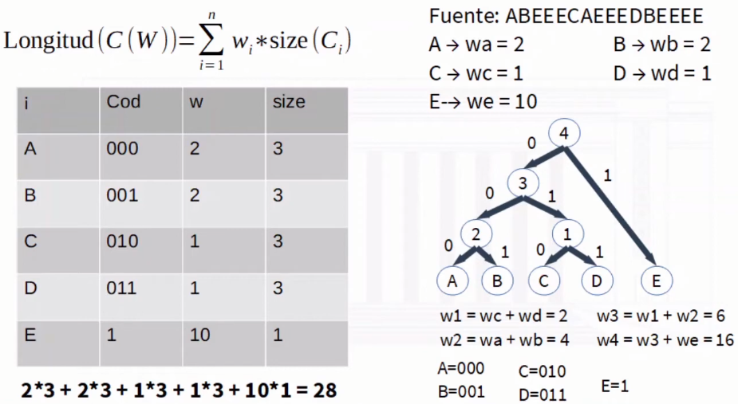
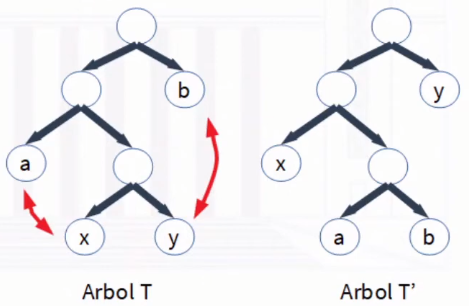
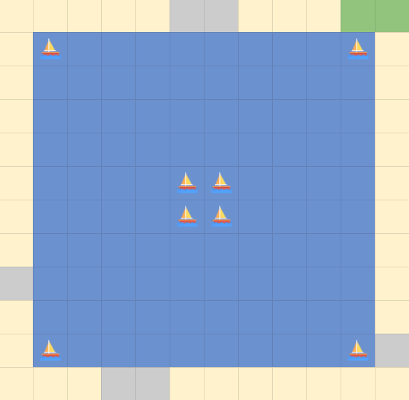

# Algoritmos Greedy

## Índice

- [Ventajas y desventajas](#ventajas-y-desventajas)
- [Problema de Scheduling](#problema-de-scheduling)
  - [Posibles criterios](#posibles-criterios)
  - [La charla que termina antes](#la-charla-que-termina-antes)
  - [Demostración](#demostración)
  - [Implementación](#implementación)
- [Árboles de Huffman](#árboles-de-huffman)
  - [Qué son los códigos](#qué-son-los-códigos)
  - [Propuesta de Huffman](#propuesta-de-huffman)
  - [Implementación](#implementación-huffman)
  - [Demostración](#optimalidad-huffman)
- [Problema del Cambio](#problema-del-cambio)
  - [Propuesta greedy](#propuesta-greedy)
  - [Sistemas canónicos y no canónicos](#sistemas-canónicos-y-no-canónicos)
- [Problema de compras con inflación](#problema-de-compras-con-inflación)
- [Problema de la carga de combustible](#problema-de-la-carga-de-combustible)
- [Problema de la mochila](#problema-de-la-mochila)
  - [Posibles criterios](#posibles-criterios-1)
- [Problema del Scheduling II : Minimizando latencia máxima](#problema-del-scheduling-ii--minimizando-latencia-máxima)
  - [Posibles criterios](#posibles-criterios-2)
  - [La tarea con menor deadline](#la-tarea-con-menor-deadline)
  - [Demostración](#demostración-por-inducción)
- [Problema de Optimal Caching](#problema-de-optimal-caching)
- [Problema de botes y faros](#problema-de-botes-y-faros)

Algunos algoritmos greedy que ya vimos anteriormente:
- Dijkstra
- Prim
- Kruskal

En algoritmos greedy, en cada paso se toma la decisión óptima localmente, con la esperanza de encontrar la solución óptima global mediante ella.

## Ventajas y desventajas

**Ventajas:**
- Son intuitivos de pensar y fáciles de entender.
- Suelen funcionar rápido.
- Para problemas complejos, pueden ser una buena aproximación.

**Desventajas:**
- No siempre se llega a la solución óptima.
- Es difícil probar que se llega a la solución óptima.

## Problema de Scheduling

Tengo un aula donde se dan charlas. Cada instructor definió arbitrariamente e independientemente un horario de inicio y fin fijos, por lo que algunas charlas pueden estar superpuestas.

Mi objetivo es que se den la mayor cantidad de charlas, teniendo en cuenta que no se pueden dar más de una charla en un mismo horario.

Tenemos que determinar cómo seleccionamos las charlas: a la hora de hacerlo, un subconjunto de charlas pueden ser incompatibles y no ser elegibles en la solución.

### Posibles criterios

- **Horario de inicio:** seleccionar la charla que comienza antes.
- **Duración:** seleccionar la charla más corta.
- **El menos conflictivo:** seleccionar la charla que tiene menos conflictos con otras charlas.
- **Horario de fin:** seleccionar la charla que termina antes.

Las que no funcionan se pueden determinar con un contraejemplo:  



¿Qué pasa si no encontramos contraejemplo para un caso?  
Podemos intentar probar que utilizando ese criterio de selección, la misma nos lleva a obtener el óptimo global.

### La charla que termina antes

Aparenta ser imposible encontrar un contraejemplo para este criterio, por lo tanto intentaremos demostrar que esta heurística nos lleva a la solución óptima.  
Si demostramos lógicamente que el resultado es óptimo, entonces tendremos nuestro algoritmo greedy.

Primero definamos cómo va a funcionar:

### Pseudocódigo
```pseudo
Sea P set de charlas
Sea A set de charlas seleccionadas

Mientras P no esté vacío:
    Elegir charla i que termina antes
    A = A + {i}
    Eliminar de P todas las charlas que se superponen con i

Retornar A
```

El set retornado por el algoritmo es compatible, ya que en cada iteración se elimminan todas las charlas incompatibles con la seleccionada.

### Análisis del algoritmo: Optimalidad

Llamaremos O a un set de charlas óptimo.

No podemos asegurar que A = O, ya que podrían haber varias soluciones óptimas.

Queremos demostrar que |A| = |O|.

Para ello utilizaremos la idea de que el algoritmo greedy "se mantiene por delante" de la solución óptima.

Podemos enumerar los elementos de A en orden en el que fueron seleccionados:  
${i_1, i_2, ..., i_k}$ con |A| = k.

Además, podemos enumerar los elementos de O en orden de hora de inicio:  
${j_1, j_2, ..., j_m}$ con |O| = m.  
Ordenar por hora de inicio o por hora de finalización es lo mismo ya que las charlas son compatibles.

Compararemos las soluciones parciales construidas por greedy con los segmentos iniciales de la solución óptima.

Demostraremos que greedy siempre tiene al menos tantas charlas como la solución óptima.

### Demostración

Analicemos el primer elemento de O y A:  
Por cómo se selecciona en greedy, podemos ver que: $f(i_1) \leq f(j_1)$

Nunca $f(i_1) > f(j_1)$, ya que si fuese así, sería una violación de la elección greedy.

### Inducción

Queremos demostrar que para todo $r \leq k$, $f(i_r) \leq f(j_k)$.

Esto es cierto para nuestro caso base r = 1.  
Asumiremos que es cierto para r-1 con r>1, entonces $f(i_{r-1}) \leq f(j_{r-1})$.

Como O está compuesto por charlas compatibles:  
$f(j_{r-1}) \leq s(j_r)$

Dadas las últimas dos inecuaciones, es posible obtener:  
$f(i_{r-1}) \leq s(j_r)$

Eso implica que en el momento en que greedy seleccionó $i_r$ también podría haber seleccionado $j_r$. Y como greedy selecciona aquel disponible que termina antes, entonces $f(i_r) \leq f(j_r)$.

Esta lógica podemos aplicarla desde r = 1 hasta r = m, por lo que podemos concluir que nuestro algoritmo greedy es óptimo.

### Implementación

Para implementar de forma eficiente el pseudocódigo, debemos encontrar la forma de recorrer las charlas de forma conveniente según el criterio de selección.

Podemos ordenar las charlas por hora de finalización, y luego elegir el primer elemento de la lista ordenada, sacándo aquellos que no son compatibles.

```python
def scheduling(horarios):
	horarios_ordenados = ordenar_por_horario_fin(horarios)
	charlas = []
	for horario in horarios_ordenados:
		if len(charlas) == 0 or not hay_interseccion(charlas[-1], horario):
			charlas.append(horario)
	return charlas

def hay_intersection(anterior, nueva):
    return anterior[FIN] > nueva[INICIO]:
```

### Complejidad

El ordenamiento de las charlas tiene una complejidad de $O(n\ log\ n)$, y luego recorrerlas tiene una complejidad de $O(n)$. Por lo tanto, la complejidad temporal del algoritmmo es $O(n\ log\ n)$, y su complejidad espacial, intuitivamente, $O(n)$.


## Árboles de Huffman

### Qué son los códigos

Los **códigos** son una forma de representar mensajes utilizando una combinación de símbolos. Pueden tener longitud fija o variable, y se dice que son **decodificables** cuando para cualquier suceción de símbolos, se puede determinar un único mensaje. 

Los códigos de longitud fija son siempre decodificables, mientras que los de longitud variable pueden no serlo, ya que dada una sucesión de símbolos, no es posible determinar si un símbolo termina y otro comienza.

Los **códigos prefijos** son aquellos que son siempre decodificables, ya que no hay ningún código que sea prefijo de otro.

### Propuesta de Huffman

Huffman plantea una codificación prefija y de longitud variable basada en la frecuencia de los caracteres que componen un texto; utiliza un heap(de mínimos) de forma auxiliar para ir generando el árbol de códigos.  
Su solución es óptima, no existen otros códigos prefijos para una misma fuente que la codifique en menor longitud.

Sea Alfabeto $A = (a_1, a_2, ..., a_n)$  
Llamaremos $W = (w_1, w_2, ..., w_n)$ a sus frecuencias.

Vamos a construir $C(W) = (c_1, c_2, ..., c_n)$, códigos prefijos y binarios.

$Longitud(C(W)) = \sum_{i=1}^{n} w_i \cdot size(c_i)$

De tal forma que $Longitud(C(W)) \leq Longitud(T(W))$ para cualquier otro código prefijo T(W).

### Código prefijo: Árbol binario

Podemos representar un código prefijo mediante un árbol binario, donde las hojas son los códigos y cada nodo tiene 2 o ningún hijo. El algoritmo de Huffman permite que este árbol sea compacto y de código prefijo.



### Algoritmo Greedy

Inicialmente cada código $c_i$ es un nodo hoja con peso $w_i$.

Mientras quede más de un nodo sin padre:  
Toma los dos nodos x, y de menor peso sin padre.
Crea un nuevo nodo z con $w_z = w_x + w_y$.
Define a z como padre de x e y.







<a id='implementación-huffman'></a>

### Implementación

Utilizaremos un Heap de mínimos, donde el nodo del árbol será el elemento y la frecuencia su clave.

En cada iteración se obtienen los 2 nodos de menor peso y se ingresa un nuevo nodo con la suma de sus pesos.

El último elemento en el heap es la raíz del árbol.

```pseudo
Desde i = 1 a n
  Crear nodo z
  z.char = a[i]
  z.w = w[i]

  Heap.add(z, z.w)

Desde i = 1 a n-1
  x = Heap.get()
  y = Heap.get()

  Crear nodo z
  z.left = x
  z.right = y
  z.w = x.w + y.w

  Heap.add(z, z.w)

Retornar Heap.get()
```

$T(n) = O(n\ log\ n)$

<a id='optimalidad-huffman'></a>

### Optimalidad

Para probar que nuestro resultado es óptimo debemos realizar 2 demostraciones.

- Prueba de selección greedy  
Demostrar que elegir en dos mensajes de menor peso nos acerca a la solución óptima global.

- Prueba de los subproblemas  
Demostrar que el subproblema derivado de nuestra elección se puede solucionar mediante la misma selección greedy.

### Selección greedy

Sea $A = (a_1, a_2, ..., a_n)$ un alfabeto con frecuencias $W = (w_1, w_2, ..., w_n)$.

Sean a y b pertenecientes a A los 2 mensajes con menor frecuencia de la colección.

Existe un código prefijo óptimo tal que:  
$size(c_a) = size(c_b)$ y solo difieren en su ultimo bit.  
Además $size(c_a) = size(c_b) \geq size(c_i)$ con i en A - {a,b}.

x, y en A son siblings en hojas de máxima profundidad en árbol T.

a, b en A tal que $w_x \geq w_y \geq w_b \geq w_a$.

Intercambiamos a con x y b con y, y llamaremos T' al árbol resultante.



Tenemos que:

$Longitud(C(W))= \sum_{i=1}^{n} w_i \cdot size(c_i)$

$Longitud(T(W))-Longitud(T'(W)) =$  
$w_a \cdot (size(a)) + w_b \cdot (size(b)) + w_x \cdot (size(x)) + w_y \cdot (size(y)) - w_a' \cdot (size(a')) - w_b' \cdot (size(b')) - w_x' \cdot (size(x')) - w_y' \cdot (size(y'))$

$size(a)=size(x')$  $size(x)=size(a')$  
$size(b)=size(y')$  $size(y)=size(b')$  
Y como los pesos no cambian:  
$(w_a - w_x)\cdot size(a) + (w_b - w_y) \cdot size(b) + (w_x - w_a) \cdot size(x) + (w_y - w_b) \cdot size(y)$  

Dado $w_x \geq w_y \geq w_b \geq w_a$ y $size(a) \leq size(b) \leq size(x) \leq size(y)$, entonces:

$Longitud(T(W))-Longitud(T'(W)) \geq 0$, es decir T' disminuye o mantiene el tamaño de T.

### Prueba de los subproblemas

Sea $A = (a_1, a_2, ..., a_n)$ un alfabeto con frecuencias $W = (w_1, w_2, ..., w_n)$.
Sean a y b en A los 2 mensajes de menor frecuencia.

$A' = A - {a,b} + {z}$ con $w_z = w_a + w_b$ y el resto de los pesos iguales.

Sea T el árbol de códigos prefijos óptimo para C.
Sea T' el árbol de códigos prefijos óptimo para C'.

Probaremos que T se puede obtener de T' reemplazando la hoja z por un nodo con hijos a y b, así demostrando que la solución greedy de un subproblema nos lleva a la solución óptima global.

## Problema del Cambio

Se tiene un sistema monetario (ejemplo, el nuestro). Se quiere dar "cambio" de una determinada cantidad de plata. Implementar un algoritmo que devuelva el cambio pedido, usando la mínima cantidad de monedas/billetes.

### Propuesta greedy

Vamos elegiendo el billete/moneda de mayor valor que no supere la cantidad restante.

```pseudo
Cambio = X
#Monedas = 0
Mientras X > 0
  Seleccionar moneda de mayor valor que no supere X
  Cantidad = Cambio // moneda
  Cambio = Cambio - Cantidad * moneda
  #Monedas = #Monedas + 1
Retornar #Monedas
```

Esta solución tiene complejidad $O(c)$, donde n es la cantidad de monedas/billetes en el sistema monetario.

Este algoritmo parece ser óptimo, y lo es en ciertos casos pero no en todos.

### Sistemas canónicos y no canónicos

Si el sistema monetario fuera [1, 5, 6, 9] y quisiéramos dar cambio de 11, el algoritmo greedy nos devolvería 9, 1, 1, mientras que la solución óptima sería 6, 5.

Existen casos en los que el algoritmmo greedy funciona, por ejemplo [1, 5, 10, 25, 50, 100]. A estos sistemas se los llama sistemas canónicos, standard, ordenado o greedy.

No se conoce la respuesta a qué propiedades debe cumplir un sistema monetario para que el algoritmo greedy sea óptimo, pero se sabe cómo determinarlo: en [Optimal Bounds for the ChangeMaking Problem](https://www.cs.cornell.edu/~kozen/Papers/change.pdf) se demuestra que siempre es posible encontrar un contraejemplo en caso de existir entre valores de x que cumplan $c_3 +1 < x < c_n + c_{n-1}$. En [A Polynomial-time Algorithm for the Change-Making Problem](https://ecommons.cornell.edu/handle/1813/6219) se presenta un algoritmo $O(n^3)$ para determinar si un sistema monetario es canónico.

Para resolver este problema, necesitaremos un algoritmo de programación dinámica.


## Problema de compras con inflación

Tenemos unos productos dados por un arreglo R, donde $R_i$ es el precio del producto i. Cada día debemos comprar uno y solo uno de los productos. El problema es que vivimos en un país con elevada inflación, por lo que el precio de los productos aumenta cada día.

El precio del producto i en el día j es $R_i^{j+1}$ con j comenzando en 0.

Implementar un algoritmo greedy que nos permita comprar todos los productos de forma tal que minimicemos el costo total.

La solución greedy coincide con el algoritmo más intuitivo: comprar el producto más caro todos los días, ya que éstos aumentan su precio en mayor magnitud que los más baratos.

## Problema de la carga de combustible

Un camión debe viajar desde una ciudad a otra deteniéndose a cargar combustible cuando sea necesario. El tanque de combustible le permite viajar hasta K kilómetros. Las estaciones se encuentran distribuidas a lo largo de la ruta siendo $d_i$ la distancia desde la estación $i-1$ hasta la estación i.

Implementar un algoritmo que decida en qué estaciones debe cargar combustible de manera que se detenga la menor cantidad de veces posible. ¿Cuál es la complejidad algorítmica?

La solución greedy es cargar combustible en la estación más lejana posible, siempre y cuando no se quede sin combustible antes de llegar a la próxima estación. La complejidad algorítmica es $O(n)$. En este caso es también un algoritmo muy intuitivo, pero no es fácil demostrarlo.

**No siempre es fácil demostrar que un algoritmo greedy es óptimo: sin embargo, si es muy difícil encontrar un contraejemplo, es probable que lo sea.**


## Problema de la mochila

Tenemos una mochila con una capacidad $V$(volumen). Hay elementos a guardar en la mochila, cada uno con un volumen $volumen_i$ y un valor $valor_i$. Implementar un algoritmo greedy que permita guardar la mayor cantidad de valor en la mochila.

### Posibles criterios

- **Valor:** seleccionar el elemento con mayor valor.
- **Volumen:** seleccionar el elemento con menor volumen.
- **Valor por unidad de volumen:** seleccionar el elemento con mayor relación valor/volumen.

Ninguno de los 3 funcionan bajo las condiciones establecidas:

**Seleccionar el elemento con mayor valor:**

Con $W = 10$ y $elementos(valor, volumen) = [(10, 10), (9, 9), (8, 1)]$  
Nos devuelve [(10, 10)] con un valor total de 10, mientras que la solución óptima es [(9, 9), (8, 1)] con un valor total de 17.

**Seleccionar el elemento con menor volumen:**

Con $W = 10$ y $elementos(valor, volumen) = [(100, 10), (9, 9), (8, 1)]$  
Nos devuelve [(9, 9), (8, 1)] con un valor total de 17, mientras que la solución óptima es [(100, 10)] con un valor total de 100.

**Seleccionar el elemento con mayor relación valor/volumen:**

Con $W = 10$ y $elementos(valor, volumen) = [(3, 1), (10, 10)]$  
Nos devuelve [(3,1)] con un valor total de 3, mientras que la solución óptima es [(10, 10)] con un valor total de 10.

El clásico "muy bueno para su precio"... pero si el precio es muy bajo, tal vez la "calidad" también!

### Problema de la mochila fraccionaria

En este caso, se permite fraccionar los elementos. Implementar un algoritmo greedy que permita guardar la mayor cantidad de valor en la mochila.

En este caso es óptimo seleccionar los elementos con mayor relación valor/volumen, ya que si seleccionamos un elemento con menor relación, siempre podremos seleccionar una fracción del elemento con mayor relación que nos permita obtener un mayor valor.

## Problema del Scheduling II : Minimizando latencia máxima

Tenemos tareas con un deadline $d_i$ y una duración $t_i$ que se pueden hacerse en cualquier momento, pero acumulan latencia si no se realizan en el momento en que se deberían. Implementar un algoritmo greedy que permita minimizar la latencia acumulada.

Formalmente, si definimos que una tarea i empiesa en $s_i$, con momento de finalización $f_i = s_i + t_i$, la latencia de la tarea i es $l_i = max(0, f_i - d_i)$.

### Posibles criterios

- **La que dura menos:** seleccionar la tarea con menor $t_i$.
- **La que dura más:** seleccionar la tarea con mayor $t_i$.
- **La que queda menos para poder hacerla en tiempo:** seleccionar la tarea con menor $d_i-t_i$.

**La que dura menos:**
Con $tareas(d_i, t_i) = [(12, 2), (10, 10)]$
Haríamos la tarea 1 primero y la tarea 2 después, acumulando una latencia de 2, mientras que si hacemos la tarea 2 primero y la tarea 1 después, acumulamos una latencia de 0.

**La que dura más:**
Con $tareas(d_i, t_i) = [(110, 100), (12, 10)]$
Haríamos la tarea 1 primero y la tarea 2 después, acumulando una latencia de 98, mientras que si hacemos la tarea 2 primero y la tarea 1 después, acumulamos una latencia de 0.

**La que queda menos para poder hacerla en tiempo:**
Con $tareas(d_i, t_i) = [(2, 1), (10, 10)]$  
Haríamos la tarea 2 primero y la tarea 1 después, acumulando una latencia de 9, mientras que si hacemos la tarea 1 primero y la tarea 2 después, acumulamos una latencia de 1.

### La tarea con menor deadline

Puede sonar antiintuitivo ya que no tiene en cuenta la duración, pero pensemos: sea el orden en que hagamos las tareas, el tiempo que nos lleva hacer todas las tareas es el mismo. Lo importante es completar primero las tareas que tienen menor deadline y no sumar deadline de esas tareas.

### Demostración por inducción

Formalmente hablando, la latencia máxima que puede acumular al hacer $tarea_i$ antes que $tarea_i+1$, ordenados en orden creciente de deadline, es $max(0, t_i + t_{i+1} - d_{i+1})$. Si hacemos la $tarea_i+1$ antes que la $tarea_i$, la latencia máxima que acumularíamos sería $max(0, t_i + t_{i+1} - d_i)$.

Como $d_i \leq d_{i+1}$, entonces $max(0, t_i + t_{i+1} - d_{i+1}) \leq max(0, t_i + t_{i+1} - d_i)$. Es decir, acumula menos o la misma latencia si hacemos la tarea con menor deadline primero. Esto es cierto para todo par de $(tarea_i, tarea_j)$ con $i < j$, por lo que elegir la tarea con el menor deadline sería una solución óptima local.

Ahora, supongamos que ya elegimos una $tarea_{i-1}$ en base a lo dicho. La inecuación sigue siendo válida ya que sólo tendríamos que agregar $f_{i-1}$ en ambos términos, que se terminan cancelando; utilizar este criterio minimiza la latencia total en cada paso, sin importar lo que se haya elegido anteriormente, y como nuestra primera elección fue óptima, nos termina llevando a la solución óptima global.


## Problema de Optimal Caching

Podemos tener hasta k elementos a mano(en la memoria caché), para acceder al resto hay que recurrir a la RAM.

Tenemos un conjunto de datos U en memoria general (n en total), una memoria caché de k < n elementos. Tenemos una secuencia de pedidos de datos $d_i$. Si $d_i$ está en la caché, podemos acceder a éste directamente. Si no está se produce un cache miss y debemos traerlo de la memoria general a la caché, evictando un elemento si la caché está llena. Queremos minimizar la cantidad de cache misses.

¿Qué es lo que hay que definir? Los primeros k elementos únicos producirán cache misses empezando con caché vacía. Lo que hay que definir es qué elemento se debe sacar una vez llena la caché con esos k elementos.

Intuitivamente, la solución greedy óptima es sacar el elemento que no se va a pedir en el futuro más cercano; de esta forma habremos evitado un cache miss desde el momento hasta el próximo pedido de ese elemento. Que, al haber elegido otro elemento, se podría haber producido antes por evictar un elemento que se iba a pedir en el futuro cercano.

### Qué pasa si no conocemos la secuencia de pedidos

En este caso, ante la incerteza respecto a qué elemento se pedirá en el futuro, no es posible determinar un algoritmo óptimo. La heurística greedy preferida es la de Least Recently Used (LRU), que consiste en sacar el elemento que no se pidió hace más tiempo.

## Problema de botes y faros

Se tiene inicialmente una matriz donde en cada celda hay un bote, o no, y se quiere poner faros para iluminarlos todos. Los faros iluminan su celda y todas las adyacentes, incluyendo las diagonales, y las directamente adyacentes a éstas. Implementar un algoritmo greedy que permita poner la menor cantidad de faros posibles.

El algoritmo greedy más intuitivo es poner un faro en la celda que ilumina la mayor cantidad de botes no iluminadas, e ir repitiendo el proceso hasta que todos los botes estén iluminados. Sin embargo, este algoritmo no es óptimo:



En el caso de la imagen, el algoritmo greedy pondría un faro en la celda central, y luego uno para cada bote ubicado en las esquinas, totalizando 5 faros. La solución óptima es poner un faro en el centro cada cuadrante, iluminando todos los botes con 4 faros.

En realidad, para este problema no existe una solución greedy óptima, y debemos recurrir a **programación dinámica**.
