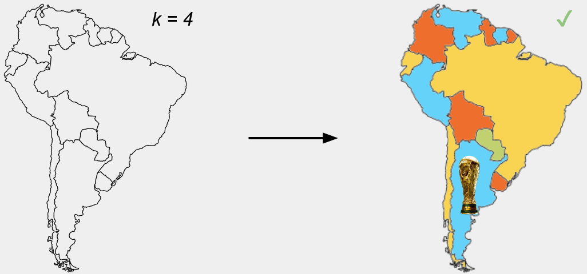
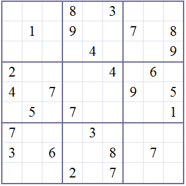

# BF vs. Backtracking

## Índice

- [Esquema tentativo de backtracking](#esquema-tentativo-de-backtracking)
- [Problema de N reinas](#problema-de-n-reinas)
- [Independent Set](#independent-set)
- [Camino Hamiltoniano](#camino-hamiltoniano)
- [Problema de Coloreo de grafos](#problema-de-coloreo-de-grafos)
- [Sudoku](#sudoku)
    - [Implementación Simple](#implementación-simple)
    - [Implementación Superadora](#implementación-superadora)
    - [Semejanza con el Problema de Coloreo](#semejanza-con-el-problema-de-coloreo)
- [Knigth's Tour](#knights-tour)
    - [Semejanza con el Camino Hamiltoniano](#semejanza-con-el-camino-hamiltoniano)
- [Ejercicio: Isomorfismos en Grafos](#ejercicio-isomorfismos-en-grafos)
- [Ejercicio: Materias Compatibles](#ejercicio-materias-compatibles)
- [Ejercicio: Sumatoria de n-dados](#ejercicio-sumatoria-de-n-dados)
- [Ejercicio: Subset Sum](#ejercicio-subset-sum)
- [Optimizar un algoritmo backtracking](#optimizar-un-algoritmo-backtracking)

**Fuerza bruta** consiste en probar todas las posibles soluciones a un problema y quedarse con la mejor. Es efectivo, pero muy lento ya que puede llegar a probar todas las soluciones incorrectas antes de encontrar la correcta.

Siempre que nos topemos con un problema que pueda ser resuelto por fuerza bruta, debemos considerar si es posible aplicar backtracking:

**Backtracking** es una técnica similar a fuerza bruta; pero a diferencia de esta, backtracking se detiene al llegar a una combinación parcial que no va a llevar a una solución válida, y vuelve a la última combinación parcial que podría llevar a una solución válida y sigue probando desde ahí.

Pensemos en ejemplos sencillos:  
Dado un arreglo de enteros desordenado, queremos ordenarlo. Fuerza bruta probaría todas las posibles permutaciones del arreglo, mientras que backtracking se daría cuenta de que una permutación parcial desordenada no va a llevar a una solución válida y volvería a la última permutación parcial ordenada.

Backtracking no tiene mejor complejidad temporal teórica que fuerza bruta, pero en la práctica es mucho más rápido.

## Esquema tentativo de backtracking

1. Si ya encontré una solución, la devuelvo.
2. Avanzo si puedo.
3. Pruebo si la solución parcial es válida.
    a. Si es válida, llamo recursivamente y vuelvo al paso 1.
    b. Si no es válida, retrocedo y vuelvo al paso 2.
4. Si llegué hasta acá, ya probé todas las posibles soluciones y no encontré ninguna válida.

No siempre sigue este esquema, pero suelen ser similares.

## Problema de N reinas

Dado un tablero de ajedrez N x N, queremos colocar N reinas de tal forma que ninguna reina pueda atacar a otra. Una reina puede atacar a otra si están en la misma fila, columna o diagonal.

Fuerza bruta llegaría a probar todas las posibles combinaciones que tienen 2, 3, ..., N-1 reinas en una misma fila, aunque esto no es necesario; en cambio, backtracking se daría cuenta al llegar a una fila con 2 reinas que no va a llevar a una solución válida y volvería a la solución parcial donde solo hay una reina en cada fila.


### Implementación

A fines de simplicidad, utilizaremos un grafo para representar el tablero de ajedrez, donde todos los vértices de una misma fila están conectados entre sí, lo mismo con columnas y diagonales. Entonces, si dos reinas son adyacentes, están en la misma fila, columna o diagonal.

```python
def n_reinas(n):
    Devuelve el grafo con mencionada estructura.

def _ubicacion_FB(grafo, vertices, v_actual, puestos, n):
    if v_actual == len(grafo):
        return False
    if len(puestos) == n:
        return es_compatible(grafo, puestos)

    # Línea donde iría la condición de poda en Backtracking

    puestos.add(vertices[v_actual])
    if _ubicacion_FB(grafo, vertices, v_actual + 1, puestos, n):
        return True
    puestos.remove(vertices[v_actual])
    return _ubicacion_FB(grafo, vertices, v_actual + 1, puestos, n)


def _ubicacion_BT(grafo, vertices, v_actual, puestos, n):
    if v_actual == len(grafo):
        return False
    if len(puestos) == n:
        return es_compatible(grafo, puestos)

    if not es_compatible(grafo, puestos):
        return False

    puestos.add(vertices[v_actual])
    if _ubicacion_BT(grafo, vertices, v_actual + 1, puestos, n):
        return True
    puestos.remove(vertices[v_actual])
    return _ubicacion_BT(grafo, vertices, v_actual + 1, puestos, n)

def es_compatible(grafo, puestos):
    for v in puestos:
        for w in puestos:
            if v == w:
                continue
            if grafo.has_edge(v, w):
                return False
    return True

def ubicacion(grafo, n):
    puestos = set()
    vertices = list(grafo.nodes)
    if FUERZA_BRUTA:
        _ubicacion_FB(grafo, vertices, 0, puestos, n)
    else:
        _ubicacion_BT(grafo, vertices, 0, puestos, n)
    return puestos

```
Nótese que la única diferencia entre los dos algoritmos es la condición de poda presente en backtracking.

La complejidad de ambos algoritmos es $O(2^n)$, ya que para cada vértice tenemos dos opciones: incluirlo en el subconjunto o no incluirlo.

Ambos algoritmos tienen la misma complejidad, pero backtracking es mucho más rápido:  
En la clase donde se mostraron estos códigos se midió el tiempo de ejecución de ambos algoritmos para N = 8, y los resultados fueron aproximadamente 15 minutos para fuerza bruta y menos de 1 segundo para backtracking.

## Independent Set

Dado un grafo, quiero elegir N vértices de tal forma que ninguno de ellos esté conectado con otro.

Análogamente al problema de N reinas, fuerza bruta probaría todas las posibles combinaciones donde se sabe que hay 2, 3, ..., N-1 vértices conectados. Mientras que, backtracking se daría cuenta al llegar a una combinación parcial donde hay 2 vértices conectados y volvería a la última combinación parcial donde no hay vértices conectados.

Este problema, es en realidad, la versión generalizada del problema de N reinas, y la implementación planteada es casi idéntica:

### Implementación

```python
def _ubicacion_FB(grafo, vertices, v_actual, puestos, n):
    if v_actual == len(grafo):
        return False
    if len(puestos) == n:
        return es_compatible(grafo,puestos)

    # Línea donde iría la condición de poda en Backtracking

    puestos.add(vertices[v_actual])
    if _ubicacion_FB(grafo, vertices, v_actual+1, puestos, n):
        return True
    puestos.remove(vertices[v_actual])
    return _ubicacion_FB(grafo, vertices, v_actual+1, puestos, n)

def _ubicacion_BT(grafo, vertices, v_actual, puestos, n):
    if v_actual == len(grafo):
        return False
    if len(puestos) == n:
        return es_compatible(grafo,puestos)

    # La segunda condición indica que no hay suficientes vértices restantes
    if not es_compatible(grafo,puestos) or len(grafo) - v_actual < n - len(puestos):
        return False

    puestos.add(vertices[v_actual])
    if _ubicacion_BT(grafo, vertices, v_actual+1, puestos, n):
        return True
    puestos.remove(vertices[v_actual])
    return _ubicacion_BT(grafo, vertices, v_actual+1, puestos, n)

def es_compatible(grafo, puestos):
    for v in puestos:
        for w in puestos:
            if v == w: continue
            if grafo.estan_conectados(v,w):
                return False
    return True

```

La complejidad es $O(2^n)$ ya que para cada vértice tenemos dos opciones: incluirlo en el subconjunto o no incluirlo.

Ambos algoritmos tienen la misma complejidad, pero backtracking es mucho más rápido.

Si tuviéramos que devolver todas las soluciones viables, podríamos crear una lista de soluciones y en lugar de devolver True al encontrar una solución, agregarla a la lista.

## Camino Hamiltoniano

Dado un grafo, queremos encontrar un camino que pase por todos los vértices exactamente una vez.

Podríamos seguir cualquier otro recorrido, pero supongamos que hacemos un recorrido aleatorio desde un vértice inicial, tomando siempre un vértice adyacente no visitado.

En este caso, al llegar a un 'dead end' no se puede seguir el recorrido, por lo que debemos volver a la última decisión ramificable y seguir por otro camino. De esta forma, naturalmente estamos aplicando backtracking.

### Implementación

```python
def _camino_hamiltoniano_dfs(grafo, v, visitados, camino):
    visitados.add(v)
    camino.append(v)
    if len(visitados) == len(grafo):
        return True
    for w in grafo.adyacentes(v):
        if w not in visitados:
            if _camino_hamiltoniano_dfs(grafo, w, visitados, camino):
                return True
    visitados.remove(v)
    camino.pop()
    return False

```

Como no da lo mismo de qué vértice partamos:

```python
def camino_hamiltoniano(grafo):
    camino = []
    visitados = set()
    for v in grafo:
        if camino_hamiltoniano(grafo, v, visitados, camino):
            return camino
    return None

```

Su complejidad es $O(n!)$, ya que para elegir como vértice inicial tenemos n opciones, para el siguiente vértice del recorrido tenemos n-1 opciones, y así sucesivamente hasta el final en el peor caso.

Si tuviéramos que devolver todas las soluciones viables, podríamos crear una lista de soluciones y en lugar de devolver True al encontrar una solución, agregarla a la lista.

## Problema de Coloreo de grafos

Dado un grafo y K colores diferentes, ¿es posible pintar los vértices de tal forma que ningún par de vértices adyacentes tengan el mismo color?

Si K = 2, el problema se reduce a saber si el grafo es bipartito, pero si K > 2, el problema es NP-completo. Es decir, no se conoce un algoritmo polinomial que lo resuelva.

Este problema es la versión generalizada del conocido problema de los 4 colores: demostrar que cualquier mapa geopolítico plano puede ser coloreado con 4 colores de tal forma que 2 países limítrofes no tengan el mismo color. Muchos intentos de demostración fallaron tras haber sido planteado el problema en 1852, hasta que en 1976 fue demostrado que es posible mediante un algoritmo de fuerza bruta.



### Implementación

```python
def coloreo(grafo, k):
    Si todos los países están coloreados:
        return True
    Pruebo colorear con un color el siguiente país.
        Si la solución parcial es válida:
            llamo recursivamente y vuelvo al paso 1.
        Si la solución parcial no es válida:
            retrocedo y pruebo con otro color.        

    return _coloreo(grafo, k, 0, colores)

```

## Sudoku



Dado un tablero de Sudoku 9x9 dividido en 9 subgrupos de 3x3, queremos completarlo de tal forma que no haya números repetidos en filas, columnas o subgrillas.

### Implementación Simple

En un principio, podemos pensar en la siguiente implementación:

```python
def sudoku(cant_elem, M):
    cant_elem = sig_pos_a_usar(cant_elem, M)
    if cant_elem >= 9*9:
        return True
    
    for num in range(1, 10):
        if puedo_poner(num, cant_elem, M):
            M[fila(cant_elem)][columna(cant_elem)] = num
            if sudoku(cant_elem, M):
                return True
    
    M[fila(cant_elem)][columna(cant_elem)] = 0
    return False

```

Aunque el algoritmo propuesto es suficientemente bueno para cantidad de elementos acotados, existen diversas maneras de mejorarlo sustancialmente para magnitudes que requieran hacerlo. Una forma es la siguiente:

### Implementación Superadora

En cada paso recursivo, reviso cuáles son las celdas siguientes en donde puedo poner el número de la celda actual, y luego entre esas celdas elijo como siguiente la que tiene menos posibilidades de elección. Por ejemlpo, si en alguna celda válida solo puedo poner un número, la elijo y la lleno.

```python
def _resolver_sudoku_bt(matriz, faltantes):
    if len(faltantes) == 0:
        return True
    # de las faltantes nos quedamos con la válida que menos alternativas le falten:
    alternativas_por_faltante = {pos: alternativas_validas(matriz, pos) for pos in faltantes}
    siguiente = min(faltantes, key=lambda pos: len(alternativas_por_faltante[pos]))
    i, j = siguiente
    alternativas_siguiente = alternativas_por_faltante[siguiente]
    if len(alternativas_siguiente) == 0:
        return False
    faltantes.remove(siguiente)
    for alternativa in alternativas_siguiente:
        matriz[i][j] = alternativa
        if _resolver_sudoku_bt(matriz, faltantes):
            return True
    faltantes.add(siguiente)
    matriz[i][j] = NULL_ELEM
    return False

```

También se podría implementar de forma que vaya registrando qué números no se pueden utilizar en las celdas de la misma fila, columna y subgrilla al momento de ir llenando el tablero, como muchos lo hacemos al resolver un Sudoku a mano. Sin embargo esta implementación es mucho más compleja ya que hay que ir deshaciendo cada registro hecho y de forma que no resulte incoherente; no puedo simplemente decir que ahora sí puedo poner un número en una celda ya que lo saqué una fila, porque puede que en la misma columna haya el mismo número.

La complejidad de ambos algoritmos es $O(9^n)$, ya que para cada celda tenemos 9 opciones: poner un número del 1 al 9.

Ambos algoritmos tienen la misma complejidad y utilizan backtracking, pero el segundo es mucho más rápido:  
En la clase donde se mostraron estos códigos se midió el tiempo de ejecución de ambos algoritmos para tableros de tamaño 16x16, y los resultados fueron aproximadamente 18 minutos para la simple y menos de 1 segundo para backtracking.

**Moraleja:** Utilizar backtracking en sí ya es mucho más rápido que fuerza bruta, pero es importante ingeniar formas de hacerlo aún más eficiente.

### Semejanza con el Problema de Coloreo

Modelemos este problema con un grafo: los vértices son las celdas del tablero y dos vértices están conectados si están en la misma fila, columna o subgrilla.

Entonces, podemos ver este problema como coloreo de 9 colores en un grafo! Y si leiste todo desde el principio, podrás darte cuenta que varios de estos problemas resultan bastante similares entre sí. Reconocer estas similitudes nos brindará grandes ventajas a la hora de resolver problemas.

## Knigth's Tour

Dado un tablero de ajedrez y un caballo, queremos encontrar un recorrido que pase por todas las casillas exactamente una vez. Un cabaño se mueve en forma de L, dos casillas en una dirección y una en la otra.

```python
def caballo(paso=0):
    if completo(): return True # encontró solución
    x, y = obtener_posicion_actual_caballo()
    for fila, col in movimientos_caballo(x, y):
        if not dentro_de_tablero(fila, col): continue
        if casillero_ya_marcado(fila, col): continue
        mover_a_posicion(fila, col, paso)
        if (caballo(paso + 1)): return True # encontró solución
        volver_a_posicion(x, y) # no encontró solución, vuelve para atrás
    return False

```

### Semejanza con el Camino Hamiltoniano

Si leiste todo desde el principio, podrás darte cuenta que este problema es muy similar al problema de camino hamiltoniano, y un caso particular de ello, en donde los vértices del grafo son las casillas del tablero y dos vértices están conectados si un caballo puede moverse de una casilla a la otra.

En este caso podemos reutilizar completamente el algoritmo de camino hamiltoniano, simplemente debemos crear el grafo mencionado.

```python
def problema_del_caballo():
    Crear grafo
    Agregar las 8 x 8 posiciones como vértices
    Conectar cada vértice según cómo puede mover un caballo
    return camino_hamiltoniano(grafo) 

```

## Ejercicio: Isomorfismos en Grafos


Se dicen que dos grafos son **isomorfos** si podemos renombrar los vértices de uno para que sea igual al otro; es decir, si son el mismo grafo pero con visualización y nombres diferentes.

Dados 2 grafos con la misma cantidad de vértices y aristas, ¿Cómo determinamos si dos grafos son isomorfos o no? Tomemos el grafo G y H de la imagen.

### Fuerza Bruta

Probar todas las posibles asignaciones de un vértice en el grafo G contra todos los posibles vértices del grafo H.

Será que los vértices [1, 2, 3, 4, 5, 6, 7, 8] se corresponden con los vértices [a, b, c, d, g, h, i, j]?  
Será que los vértices [1, 2, 3, 4, 5, 6, 7, 8] se corresponden con los vértices [a, b, c, d, g, h, j, i]?  
Será que los vértices [1, 2, 3, 4, 5, 6, 7, 8] se corresponden con los vértices [a, b, c, d, g, i, h, j]?  
Será que los vértices [1, 2, 3, 4, 5, 6, 7, 8] se corresponden con los vértices [a, b, c, d, g, i, j, h]?  
... y seguimos permutando, aunque de antemano podríamos saber que es imposible la asignación 1,2 -> a,b ya que 1 y 2 están conectados pero a y b no.

<details>
  <summary>Click para revelar posible solución</summary>
  <pre>
⠀⠀⠀⠀⠀⠀⠀⠀⠀⠀⠀⠀⠀⠀⣀⠀⣘⣩⣅⣤⣤⣄⣠⠀⠀⠀⠀⠀⠀⠀⠀⠀⠀⠀⠀⠀⠀⠀⠀⠀⠀⠀⠀⠀⠀⠀⠀⠀
⠀⠀⠀⠀⠀⠀⠀⠀⠀⠀⠀⠀⠀⠄⢈⣻⣿⣿⢷⣾⣭⣯⣯⡳⣤⠀⠀⠀⠀⠀⠀⠀⠀⠀⠀⠀⠀⠀⠀⠀⠀⠀⠀⠀⠀⠀⠀⠀
⠀⠀⠀⠀⠀⠀⠀⠀⠀⠀⠀⠀⠀⠀⣧⠻⠿⡻⢿⠿⡾⣽⣿⣳⣧⡷⠀⠀⠀⠀⠀⠀⠀⠀⠀⠀⠀⠀⠀⠀⠀⠀⠀⠀⠀⠀⠀⠀
⠀⠀⠀⠀⠀⠀⠀⠀⠀⠀⠀⠈⢰⡶⢈⠐⡀⠀⠀⠁⠀⠀⠀⠈⢿⡽⠁⠀⠀⠀⠀⠀⠀⠀⠀⠀⠀⠀⠀⠀⠀⠀⠀⠀⠀⠀⠀⠀
⠀⠀⠀⠀⠀⠀⠀⠀⠀⠀⠀⠀⢫⢅⢠⣥⣐⡀⠀⠀⠀⠀⠀⠀⢸⢳⠀⠀⠀⠀⠀⠀⠀⠀⠀⠀⠀⠀⠀⠀⠀⠀⠀⠀⠀⠀⠀⠀
⠀⠀⠀⠀⠀⠀⠀⠀⠀⠀⠀⠠⠆⠡⠱⠒⠖⣙⠂⠈⠵⣖⡂⠄⢸⠉⠁⠀⠀⠀⠀⠀⠀⠀⠀⠀⠀⠀⠀⠀⠀⠀⠀⠀⠀⠀⠀⠀
⠀⠀⠀⠀⠀⠀⠀⠀⠀⠀⠀⢻⠆⠀⠰⡈⢆⣑⠂⠀⠀⠀⠀⠀⠏⡀⠀⠀⠀⠀⠀⠀⠀⠀⠀⠀⠀⠀⠀⠀⠀⠀⠀⠀⠀⠀⠀⠀
⠀⠀⠀⠀⠀⠀⠀⠀⠀⠀⠀⠀⢗⠀⠱⡈⢆⠙⠉⠃⠀⠀⠀⠀⠃⠁⠀⠀⠀⠀⠀⠀⠀⠀⠀⠀⠀⠀⠀⠀⠀⠀⠀⠀⠀⠀⠀⠀
⠀⠀⠀⠀⠀⠀⠀⠀⠀⠀⠀⠀⠀⠦⡡⢘⠩⠯⠒⠀⠀⠀⢀⠐⠀⠀⠀⠀⠀⠀⠀⠀⠀⠀⠀⠀⠀⠀⠀⠀⠀⠀⠀⠀⠀⠀⠀⠀
⠀⠀⠀⠀⠀⠀⠀⠀⠀⠀⠀⠀⠀⡄⢔⡢⢡⡀⠀⠀⠀⠀⠀⠀⠀⠀⠀⠀⠀⠀⠀⠀⠀⠀⠀⠀⠀⠀⠀⠀⠀⠀⠀⠀⠀⠀⠀⠀
⠀⠀⠀⠀⠀⠀⠀⠀⠀⠀⠀⠀⠀⠁⢆⠸⡁⠋⠃⠁⠀⢀⢠⣄⠀⠀⠀⠀⠀⠀⠀⠀⠀⠀⠀⠀⠀⠀⠀⠀⠀⠀⠀⠀⠀⠀⠀⠀
⠀⠀⠀⠀⠀⠀⠀⠀⠀⠀⠀⠀⢰⡰⠌⣒⠡⠄⠀⢀⠔⠁⣸⣿⣷⣤⣀⡄⠀⠀⠀⠀⠀⠀⠀⠀⠀⠀⠀⠀⠀⠀⠀⠀⠀⠀⠀⠀
⠀⠀⠀⠀⠀⠀⠀⣐⣤⡄⠀⠀⠘⢚⣒⢂⠇⣜⠒⠉⠀⢀⣿⣿⣿⣿⣿⣿⣿⣷⣶⣶⣦⣔⣀⢄⠀⠀⠀⠀⠀⠀⠀⠀⠀⠀⠀⠀
⠀⡀⢀⢠⣤⣶⣿⣿⣿⡆⠀⠀⠐⡂⠌⠐⠝⠀⠀⠀⢀⣾⣿⣿⣿⣿⣿⣿⣿⣿⣿⣿⣿⣿⣿⣿⣷⣤⠀⠀⠀⠀⠀⠀⠀⠀⠀⠀
⢨⣶⣿⣿⣿⣿⣿⣿⣿⣿⣤⡶⢐⡑⣊⠀⡴⢤⣀⣀⣿⣿⣿⣿⣿⣿⣿⣿⣿⣿⣿⣿⣿⣿⣿⣿⣿⣷⠀⠀⠀⠀⠀⠀⠀⠀⠀⠀
⢸⣿⣿⣿⣿⣿⣿⣿⣿⣿⣿⡏⠀⠷⡈⠀⠶⢶⣰⣸⣿⣿⣿⣿⣿⣿⣿⣿⣿⣿⣿⣿⣿⣿⣿⣿⣿⣿⣆⠀⠀⠀⠀⠀⠀⠀⠀⠀
⢾⣿⣿⣿⣿⣿⣿⣿⣿⣿⣿⣯⣉⠑⠚⣙⡒⠒⠲⣾⣿⣿⣿⣿⣿⣿⣿⣿⣿⣿⣿⣿⣿⣿⣿⣿⣿⣿⣿⡁⠀⠀⠀⠀⠀⠀⠀⠀
⣸⣿⣿⣿⣿⣿⣿⣿⣿⣿⣿⡷⠶⠀⠀⠤⣬⣍⣹⣿⣿⣿⣿⣿⣿⣿⣿⣿⣿⣿⣿⣿⣿⣿⣿⣿⣿⣿⣿⣄⠀⠀⠀⠀⠀⠀⠀⠀
⣸⣿⣿⣿⣿⣿⣿⣿⣿⣿⣿⣛⣙⠀⢠⠲⠖⠶⣾⣿⣿⣿⣿⣿⣿⣿⣿⣿⣿⣿⣿⣿⣿⣿⣿⣿⣿⣿⣿⣿⡄⠀⠀⠀⠀⠀⠀⠀
⣿⣿⣿⣿⣿⣿⣿⣿⣿⣿⣿⣯⣭⣰⢘⣙⣛⣲⣿⣿⣿⣿⡿⡻⠿⠿⠿⠿⢿⣿⣿⣿⣿⣿⣿⣿⣿⣿⣿⣿⣿⣷⣦⡀⠀⠀⠀⠀
⢿⣿⣿⣿⣿⣿⣿⣿⣿⣿⣿⣷⠶⢾⡠⢤⣭⣽⣿⣿⣿⣿⡟⣱⠦⠄⠤⠐⡄⠹⣿⣿⣿⣿⣿⣿⣿⣿⣿⣿⣿⣿⣿⣿⣶⣤⡀⠀
⣾⣿⣿⣿⣿⣿⣿⣿⣿⣿⣿⣿⡛⣻⡕⠶⠶⣿⣿⣿⣿⣿⣿⣗⣎⠒⣀⠃⡐⢀⠙⣿⣿⣿⣿⣿⣿⣿⣿⣿⣿⣿⣿⣿⣿⣿⣷⠀
⢻⣿⣿⣿⣿⣿⣿⣿⣿⣿⣿⣿⣭⣹⣏⣛⣛⣿⣿⣿⣿⣿⣿⣿⣞⣍⣉⢉⠰⠀⠠⢹⣿⣿⣿⣿⣿⣿⣿⣿⣿⣿⣿⣿⣿⣿⣿⠅
⣽⣿⣿⣿⣿⣿⣿⣿⣿⣿⣿⣿⠶⢼⡧⢤⣽⣿⣿⣿⣿⣿⣿⣿⣿⣿⣿⣿⣯⣣⣡⣛⣿⣿⣿⣿⣿⣿⣿⣿⣿⣿⣿⣿⣿⣿⣿⣅
⡿⣷⣽⡿⠛⠋⠉⣉⡐⠶⣾⣾⣟⣻⡕⠶⣾⣿⣿⣿⣿⣿⣿⣿⣿⣿⣿⣿⣿⣿⣿⣿⣿⣿⣿⣹⣫⣿⣿⣿⣿⣿⣿⣿⣿⣿⣿⠗
⢸⣿⣟⣥⡶⢘⡻⢶⡹⣛⣼⣿⣯⣽⢯⣙⣿⣿⣿⣿⣿⣿⣿⣿⣿⣿⣿⣿⣿⣿⣿⣿⣿⣿⣿⠿⠿⣿⣿⣿⣿⣿⣿⡿⠿⠟⠁⠀
⠘⢟⣾⣿⣿⣚⠷⣳⢳⣫⣽⣿⣛⣾⡷⢾⣿⣿⣿⣿⣿⣿⣿⣿⣿⣿⣿⣿⣿⣿⣿⣿⣿⣿⣿⣆⠀⠀⠁⠀⠈⠀⠀⠀⠀⠀⠀⠀
⠀⠀⠙⢋⣿⣿⣯⣙⣯⣵⣿⣿⣯⣽⣟⣻⣿⣿⣿⣿⣿⣿⣿⣿⣿⣿⣿⣿⣿⣿⣿⣿⣿⣿⣿⡯⠀⠀⠀⠀⠀⠀⠀⠀⠀⠀⠀⠀
⠀⠀⠀⠀⠉⠛⢻⠟⣿⣿⣿⣿⣿⣿⣿⣿⣿⣿⣿⣿⣿⣿⣿⣿⣿⣿⣿⣿⣿⣿⣿⣿⣿⣿⣿⣿⡀⠀⠀⠀⠀⠀⠀⠀⠀⠀⠀⠀
⠀⠀⠀⠀⠀⠀⠀⢸⣿⣿⣿⣟⡟⣿⣿⣿⣿⣿⣿⣿⣿⣿⣿⣿⣿⣿⣿⣿⣿⣿⣿⣿⣿⣿⣿⣿⡄⠀⠀⠀⠀⠀⠀⠀⠀⠀⠀⠀
⠀⠀⠀⠀⠀⠀⣡⣿⣿⣿⣿⡗⣮⢻⣽⣿⣿⣿⣿⣿⣿⣿⣿⣿⣿⣿⣿⣿⣿⣿⣿⣿⣿⣿⣿⣿⣷⠀⠀⠀⠀
Existen múltiples formas de aplicar backtracking a este problema, queda a disposición del lector.⠀⠀⠀⠀⠀⠀⠀
  </pre>
</details>


## Ejercicio: Materias Compatibles

Se tiene una lista de materias que deben ser cursadas en el mismo cuatrimestre, cada materia está representada con una lista de cursos/horarios posibles a cursar(sólo debe elegirse un horario por cada curso). Cada materia puede tener varios cursos.

Implementar un algoritmo de backtracking que devuelva un listado con todas las combinaciones posibles que permitan asistir a un curso de cada materia sin que se solapen los horarios. Considerar que existe una función son_compatibles(curso_1, curso_2) que dados dos cursos devuelve un valor booleano que indica si se pueden cursar al mismo tiempo.

### Fuerza Bruta

La solución por fuerza bruta implicaría generar todas las posibles asignaciones.

Sea cada materia $m_i$ con $k_i$ cursos, con n materias, deberíamos combinar cada curso de cada materia con cada curso de las n materias. En total, tendríamos $k_1 \times k_2 \times ... \times k_n$ combinaciones posibles.

Si cada curso tuviese k cursos, la complejidad de aplicar fuerza bruta sería $O(k^n)$.

### Backtracking

```python
def horarios_posibles(materias, solucion_parcial):
    # Si no nos quedan materias por ver
    if len(materias) == 0:
        if solucion_posible(solucion_parcial):
            return [solucion_parcial]
        else:
            return []
    # No es solucion total, pero es solucion parcial?
    if not solucion_posible(solucion_parcial):
        return []
    # Caso general, por ahora la solucion parcial es aceptada:
    materia_actual = materias.ver_primero()
    materias.borrar_primero()

    soluciones = []
    for curso in materia_actual:
        # Si es lista con soluciones, se agregan todas. Si devuelve lista vacia, no hará nada
        soluciones.extend(horarios_posibles(materias, solucion_parcial + [curso]))
    # Volver atrás un paso, para volver a poner la materia que sacamos:
    materias.guardar_primero(materia_actual)

    return soluciones

def solucion_posible(horarios):
    ultimo = horarios.ver_ultimo()
    for curso in horarios:
        if curso == ultimo: continue
        if not son_compatibles(curso, ultimo):
            return False
    return True

```

Recuerdan la 'solución superadora' de la sección de Sudoku? Podríamos hacer algo similar en este caso, por ejemplo elegir la materia con menos cursos posibles para probar primero. De ese modo, si en algún momento no se puede seguir avanzando, se retrocederá más rápido.

Sin embargo dicha mejora no brinda una mejora sustancial en este caso ya que lo que queremos obtener es una lista con todas las posibles soluciones, y no una única solución; esto implica que descartar el curso 1 de materia Y por estar superpuesto con el curso 1 de materia X no resulte en ventaja temporal, ya que luego se debe verificar de todas formas si el curso 1 de Y es compatible con otros cursos de X. Aunque al permitir un corte más temprano en la recursión se obtendría una mejora, ésta no sería tan significativa como lo fue en el otro caso.


## Ejercicio: Sumatoria de n-dados

Escribir un algoritmo de backtracking que reciba una cantidad de dados n y una suma s, y devuelva todas las tiradas posibles de n dados cuya suma es s. Por ejemplo, con n = 2 y s = 7, debe devolver [(1, 6), (2, 5), (3, 4), (4, 3), (5, 2), (6, 1)].

¿De qué orden es el algoritmo en tiempo? ¿Y en espacio?

### Implementación

```python
def suma_dados(suma, cant_faltan, solucion_parcial, soluciones):
    if sum(solucion_parcial) == suma and cant_faltan == 0:
        soluciones.append(list(solucion_parcial))
        return
	
	if cant_faltan == 0 or sum(solucion_parcial) > n: return
    # esto lo podemos mejorar:
    if sum(solucion_parcial) + cant_faltan*MIN_DADO > suma: return
    if sum(solucion_parcial) + cant_faltan*MAX_DADO < suma: return

    for valor in range(MIN_DADO, MAX_DADO+1):
        solucion_parcial.append(valor)
        suma_dados(suma, cant_faltan-1, solucion_parcial, soluciones)
        solucion_parcial.pop()
    return

```

La complejidad temporal de este algoritmo es $O(6^n)$, ya que para cada dado tenemos 6 opciones, y la complejidad espacial lo mismo, ya que la cantidad de soluciones posibles se ve acotada superiormente por $6^n$. Esto último es posible demostrar mediante probabilidad, pero no lo desarrollaremos en este documento.


## Ejercicio: Subset Sum

Escribir una función que, utilizando backtracking, dada una lista de enteros positivos L y un entero n devuelva un subconjunto de L que suma exactamente n.

¿Cómo cambia el comportamiento del algoritmo frente a una solución por fuerza bruta?

### Implementación

```python
def subset_sum(L, index, n, solucion_parcial):
	# Si encuentro una solucion la devuelvo
	if sum(solucion_parcial) == n:
		return solucion_parcial
	
	# Si por esta rama me paso, dejo de probar
	if sum(solucion_parcial) > n or index >= len(L):
		return None

	solucion_parcial.append(L[index])
	if subset_sum(L, index+1, n, solucion_parcial)
    	return solucion_parcial
    solucion_parcial.pop()

	return subset_sum(L, index+1, n, solucion_parcial)

```

Este algoritmo backtracking resulta mucho más eficiente que fuerza bruta cuanto más grande sean la lista L y sus números, ya que se van a prevenir muchas ramas en donde la suma parcial ya supera n.

La complejidad del algoritmo es $O(2^n)$, ya que para cada elemento de la lista tenemos dos opciones: incluirlo en el subconjunto o no incluirlo.

## Optimizar un algoritmo backtracking

Supongamos que se nos pide la solución mínima/máxima entre todas las posibles soluciones. Lo más sencillo sería guardar todas las soluciones posibles y luego buscarlo entre ellas. Sin embargo es muy probable que haya una solución más eficiente utilizando algún tipo de poda aproximado: por ejemplo, la primera solución encontrada que es mínima/máxima localmente al momento de ser hallada.

También es viable aplicar un algoritmo greedy como aproximación, sabiendo que éste nos va a devolver una solución no óptima, e ir usando ese valor como cota para podar, que luego se iría actualizando a medida que se encuentran soluciones mejores.
