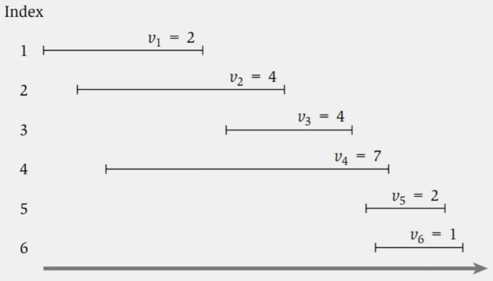
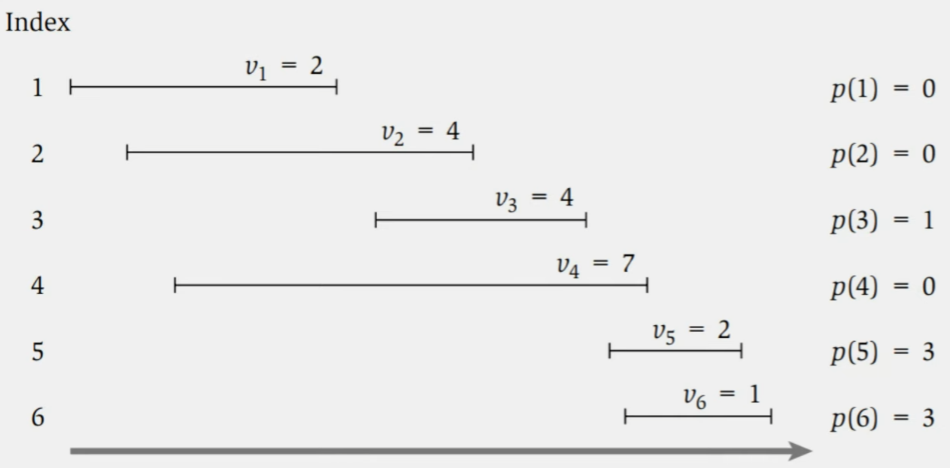

# Programación Dinámica

## Índice

- [Secuencia Fibonacci](#secuencia-fibonacci)
- [Memoization (Memorización)](#memoization-memorización)
- [Solución por Programación Dinámica](#solución-por-programación-dinámica)
- [Problema de Scheduling con pesos](#problema-de-scheduling-con-pesos)
- [Problema de los 2 escalones](#problema-de-los-2-escalones)
- [Problema de los 3 escalones](#problema-de-los-3-escalones)
- [Juan el Vago](#juan-el-vago)
- [Caminos posibles en un laberinto](#caminos-posibles-en-un-laberinto)
- [Caminos a través del teclado numérico del teléfono](#caminos-a-través-del-teclado-numérico-del-teléfono)
- [Problema de la mochila](#problema-de-la-mochila)
- [Algoritmos Psuedopolinomiales](#algoritmos-psuedopolinomiales)
- [Problema del Cambio](#problema-del-cambio)
- [Algoritmo de Bellman-Ford](#algoritmo-de-bellman-ford)
- [Algoritmo de Floyd-Warshall](#algoritmo-de-floyd-warshall)
- [Distancia de Edición o Alineamiento de Secuencias](#distancia-de-edición-o-alineamiento-de-secuencias)
- [Subset-Sum](#subset-sum)
- [Tú a Londres y yo a California](#tú-a-londres-y-yo-a-california)

## Secuencia Fibonacci

La solución más trivial para calcular el n-ésimo número de la secuencia de Fibonacci es la siguiente:

```python
def fibonacci(n):
    if n == 0:
        return 0
    if n == 1:
        return 1
    return fibonacci(n-1) + fibonacci(n-2)
```

Esta solución tiene complejidad $O(2^n)$ ya que para calcular el n-ésimo número se calculan los números n-1 y n-2, y para calcular el n-1 se calculan los números n-2 y n-3, y así sucesivamente.

Cómo podemos evitar recalcular los mismos números una y otra vez?

```python
def fibonacci_memorioso(n):
    M_FIB = [None] * (n+1)
    return fibonacci_memorioso_rec(n, M_FIB)

def fibonacci_memorioso_rec(n, M_FIB):
    if n == 0:
        return 0
    if n == 1:
        return 1
    if M_FIB[n-1] is None:
        M_FIB[n-1] = fibonacci_memorioso_rec(n-1, M_FIB)
    if M_FIB[n-2] is None:
        M_FIB[n-2] = fibonacci_memorioso_rec(n-2, M_FIB)
    M_FIB[n] = M_FIB[n-1] + M_FIB[n-2]
    return M_FIB[n]
```

A este tipo de soluciones se las llama "top-down" ya que se va construyendo la solución desde el n-ésimo elemento. Suelen ser difíciles de entender en problemas más complejos ya que el flujo de ejecución puede no ser lineal (imagínese una secuencia donde el i-ésimo valor es determinado por el elemento i-3), y la recursión puede ser difícil de seguir. Además, la recursividad implica mayor uso de memoria y puede llevar a un stack overflow si la profundidad de la recursión es muy grande.

Otra forma de resolver el problema es de forma "bottom-up", que consiste en ir construyendo la solución desde el primer elemento hasta el n-ésimo, iterativamente:

```python
def fib_iterativo(n):
    M_FIB = [None] * (n+1)
    M_FIB[0] = 0
    M_FIB[1] = 1
    for i in range(2, n+1):
        M_FIB[i] = M_FIB[i-1] + M_FIB[i-2]
    return M_FIB[n]
```

En las soluciones "bottom-up" es mucho más fácil seguir el flujo de ejecución y en consecuencia, más fácil de calcular la complejidad. Al ser PD una técnica de diseño que aplica una lógica inductiva, son más naturales e intuitivas las soluciones iterativas: una vez obtenida la ecuación de recurrencia, es muy sencillo implementarlo.

Todo esto nos trae también ventajas a la hora de aplicar optimizaciones de memoria. Podemos mejorar la solución propuesta de la siguiente manera, teniendo en cuenta que no necesitamos guardar todos los valores de la secuencia, sino sólo los dos últimos:

```python
def fib_iterativo_optimizado(n):
    if n == 0:
        return 0
    if n == 1:
        return 1
    anterior = 0
    actual = 1
    for i in range(1, n):
        siguiente = anterior + actual
        anterior = actual
        actual = siguiente
    return actual
```

A diferencia de la otra solución que ocupaba $O(n)$ de memoria, esta solución ocupa $O(1)$ de memoria.

### Memoization (Memorización)

- Memoization es la técnica de guardar los resultados previamente calculados.
- En este caso nos permitió reducir la complejidad de $O(2^n)$ a $O(n)$.

## Solución por Programación Dinámica

- Se basa en la idea de Memoization
- Construye iterativamente las soluciones a los subproblemas hasta llegar a la solución del problema original
- Se consigue la solución al problema gracias a que tenemos una forma de construir la solución a problemas más grandes en función de problemas más pequeños
- Establecemos una lógica inductiva: "Si tengo la solución a todos los problemas anteriores(casos más pequeños), ¿cómo puedo utilizarlos para construir la que busco?"

## Problema de Scheduling con pesos

Tengo un aula donde quiero dar harlas. Las charlas tienen horario de inicio y fin, y un peso asociado que indica el valor de la charla. No puedo dar dos charlas al mismo tiempo. *¿Cuál es la mayor cantidad de peso que puedo obtener?* Podemos preguntarnos si se podrá resolver con un algoritmo greedy, les adelanto que no es el caso.

Un buen punto de partida es tratar de ordenar las charlas con algún criterio, de forma que nos permita partir el problema en subproblemas más pequeños que efectivamente nos sirvan para problemas más grandes. Probemos ordenarlos por horario de fin:



Una forma sencilla de atacar estos problemas es definir qué elecciones puedo hacer, y qué implica cada elección. En nuestro caso, si elijo una charla, no puedo elegir las charlas que se superponen con ella. Si decidimos dar la charla 6, nuestra opción queda acotada por las charlas 1 a 4, ya que las otras se ven superpuestas con charla 6.

Si definimos una función $p(i)$ que nos da el rango de charlas anteriores que podemos elegir si decidimos dar la charla i:



Como todas las charlas previas a la charla i que finalicen antes que empiece ella serán compatibles con ella, indicaremos sólo la última entre el rango. De esta forma, podemos ahorrar tener que recorrer todas las charlas para encontrar las compatibles.

Estos rangos son nuestros subproblemas: teniendo todas las charlas originales, podemos decidir dar la última charla o no. Si decidimos darla, el valor de la solución será el $valor_i$ más el valor de la solución del rango compatible con ella. Si decidimos no darla, el valor de la solución será el valor de la solución del rango 1 hasta i-1. Lo que debemos hacer es comparar estos dos valores y quedarnos con el mayor.

Formalizando esto, definimos la función $OPT(i)$ como el valor de la solución óptima para las charlas 1 hasta i. La solución al problema original será $OPT(n)$, donde n es la cantidad de charlas.

La ecuación de recurrencia es la siguiente:

$OPT(i) = max(valor_i + OPT(p(i)), OPT(i-1))$

### Solución recursiva

```python
# i es el índice de la charla actual, considerando el primero como 1
# Considerando que los valores están ordenadas por horario de fin
def scheduling_rec(valores, p, i):
    if i == 0:
        return 0
    return max(valores[i-1] + scheduling_rec(valores, p, p[i-1]),
        scheduling_rec(valores, p, i-2))
```

### Solución memoriosa

```python
def scheduling_memorioso(valores, p, i):
    M_OPT = [None] * (i+1)
    return scheduling_memorioso_rec(valores, p, i, M_OPT)

def scheduling_memorioso_rec(valores, p, i, M_OPT):
    if i == 0:
        return 0
    if M_OPT[i-1] is None: # Si aún no calculamos la solución para i-1
        M_OPT[i-1] = scheduling_memorioso_rec(valores, p, i-1, M_OPT)
    if M_OPT[p(i)] is None: # Si aún no calculamos la solución para p(i)
        M_OPT[p(i)] = scheduling_memorioso_rec(valores, p, p[i], M_OPT)
    M_OPT[i] = max(valores[i-1] + M_OPT[p(i)-1], M_OPT[i-2])
    return M_OPT[i]
```

### Solución iterativa

```python
def scheduling_iterativo(valores, p, n):
    if n == 0:
        return 0
    M_OPT = [0] * (n+1)
    M_OPT[0] = 0
    for i in range(1, n+1):
        M_OPT[i] = max(valores[i-1] + M_OPT[p(i)], M_OPT[i-1])
    return M_OPT[n]
```

### Cómo obtener el conjunto de charlas

La solución más trivial sería ir guardando el conjunto de charlas a dar en cada subproblema, pero esto implica una complejidad de $O(n)$ en cada una de ellas, lo que nos llevaría a una complejidad de $O(n^2)$ en total.

Lo que podemos hacer es ver $M\_OPT$ y comparar $M\_OPT[i]$ con $M\_OPT[i-1]$. Si son iguales, la charla i no fue considerada, y si son distintos, la charla i fue considerada. Haciendo este recorrido desde n hasta 1, podemos obtener el conjunto de charlas a dar en $O(n)$.

*En realidad que sean iguales no necesariamente implica que no fue considerada, ya que puede haber más de una solución óptima.*

## Características de Programación Dinámica

- Explora todas las posibles soluciones sin repetir cálculos, utilizando la memorización. Nos ayuda a evitar explorar un espacio exponencial de soluciones por fuerza bruta.
- Descompone el problema en subproblemas más pequeños que permitan construir la solución al problema original

## Cómo identificar problemas que se pueden resolver con Programación Dinámica

- Hay un número polinomial de subproblemas
- La solución al problema original puede ser construida a partir de las soluciones a los subproblemas
- Hay un orden natural de los subproblemas de menor a mayor, de forma que los subproblemas mayores pueden ser resuelto a partir de los menores

## Cómo encontrar la solución usando Programación Dinámica

- Necesitamos:
    - La forma que tienen los subproblemas
    - La forma en que los subproblemas se componen para solucionar subproblemas más grandes
    - Definir el orden en que se resuelven los subproblemas

## Problema de los 2 escalones

Dada una escalera de n escalones, se puede subir de a 1 o 2 escalones. *¿De cuántas formas se puede subir la escalera?*

Si la escalera tiene 0 escalones, hay 1 forma de subirla (no subir).

Si tiene 1 escalón, hay 1 forma de subirla (subir 1 escalón).

Si tiene 2 escalones, hay 2 formas de subirla (subir 1 escalón dos veces o subir 2 escalones de una vez).

Si estamos parados en el escalón n, podemos haber llegado hasta allí dando un paso chico desde el escalón n-1, o un paso grande desde el escalón n-2. Por lo tanto, la cantidad de formas de subir la escalera de n escalones es la suma de las formas de subir la escalera de n-1 escalones y de n-2 escalones.

Si definimos $OPT(i)$ como la cantidad de formas de subir una escalera de i escalones:

Para una escalera con n escalones, si subimos 1 escalón para llegar a n, tendremos $OPT(n-1)$ formas de subir la escalera. Si subimos 2 escalones para llegar a n, tendremos $OPT(n-2)$ formas de subir la escalera.

Por lo tanto, $OPT(n) = OPT(n-1) + OPT(n-2)$.

*A veces surge la siguiente duda entre los alumnos: en OPT(n-1), que equivale a OPT(n-2) + OPT(n-3), también estamos considerando OPT(n-2), que ya consideramos en OPT(n-2). ¿No estamos repitiendo cálculos? La respuesta a esta duda es que hay que repetirlos; consideremos OPT(2) = OPT(1) + OPT(0) = OPT(0) + OPT(0). Pueden ver que OPT(0) aparece 2 veces, y OPT(2) es 2, el valor correcto. OPT(n-1) y OPT(n-2) son 2 árboles distintos.*

## Problema de los 3 escalones

Dada una escalera de n escalones, se puede subir de a 1, 2 o 3 escalones. *¿De cuántas formas se puede subir la escalera?*

Si la escalera tiene 0 escalones, hay 1 forma de subirla (no subir).

Si tiene 1 escalón, hay 1 forma de subirla (subir 1 escalón).

Si tiene 2 escalones, hay 2 formas de subirla (subir 1 escalón dos veces o subir 2 escalones de una vez).

Si tiene 3 escalones, hay 4 formas de subirla (subir 1 escalón tres veces, subir 1 escalón y 2 escalones, subir 2 escalones y 1 escalón, subir 3 escalones de una vez).

Si definimos $OPT(i)$ como la cantidad de formas de subir una escalera de i escalones:

Para una escalera con n escalones, si subimos 1 escalón para llegar a n, tendremos $OPT(n-1)$ formas de subir la escalera. Si subimos 2 escalones para llegar a n, tendremos $OPT(n-2)$ formas de subir la escalera. Si subimos 3 escalones para llegar a n, tendremos $OPT(n-3)$ formas de subir la escalera.


Por lo tanto, $OPT(n) = OPT(n-1) + OPT(n-2) + OPT(n-3)$.

## Juan el Vago

Juan es ambicioso pero también algo vago. Dispone de varias ofertas de trabajo diarias, pero no quiere trabajar dos días seguidos. Dado un arreglo con el monto esperado a ganar cada día, determinar por programación dinámica el máximo monto a ganar, considerando que no va a trabajar dos días seguidos.

Por ejemplo, si el arreglo es [100, 20, 30, 70, 50], la solución es 180, trabajando el primer, tercero y quinto día.

El orden de los subproblemas es natural, podemos considerar los primeros i días como subproblemas: definamos $OPT(i)$ como el monto máximo a ganar considerando los primeros i días.

Si trabajamos el día i, no podemos trabajar el día i-1, por lo que la solución será $valor_i + OPT(i-2)$. Si no trabajamos el día i, la solución será $OPT(i-1)$.

Por lo tanto, $OPT(i) = max(valor_i + OPT(i-2), OPT(i-1))$.

### Solución recursiva

```python
def juan_el_vago(ganancias, i):
    if i == 0:
        return 0
        return max(ganancias[i-1] + juan_el_vago(ganancias, i-2),
            juan_el_vago(ganancias, i-1))
```

### Solución iterativa

```python
# Definimos G_OPT(i) como el monto máximo a ganar considerando hasta el día i, con primer día como día 0
def juan_el_vago_memorioso(ganancias):
    n_dias = len(ganancias)
    G_OPT = [0] * (n_dias)
    G_OPT[0] = ganancias[0]
    G_OPT[1] = max(ganancias[0], ganancias[1])

    for i in range(2, n_dias):
        G_OPT[i] = max(ganancias[i] + G_OPT[i-2], G_OPT[i-1])
    
    return G_OPT[n_dias-1]
```

### Construcción de los días trabajados

```python
def construir_elecciones(G_OPT, ganancias):
    dias_trabajados = []
    i_dia = len(ganancias)-1
    while i_dia >= 0:
        if i_dia == 0:
            dias_trabajados.append(i_dia)
            break
        # Si G_OPT[i_dia] corresponde al caso de trabajar el día i_dia, lo agregamos a la lista de días trabajados y saltamos dos días
        if G_OPT[i_dia] == ganancias[i_dia] + G_OPT[i_dia-2]:
            dias_trabajados.append(i_dia)
            i_dia -= 2
        # Si G_OPT[i_dia] corresponde al caso de no trabajar el día i_dia, saltamos un día
        else:
            i_dia -= 1
    dias_trabajados.reverse()
    return dias_trabajados
```

### Juan el Vago, ¿a qué se parece?

Este problema es muy similar al problema de Scheduling con pesos: cada día de trabajo es como una charla con valor = ganancia, donde cada día se ve superpuesto con el anterior y el siguiente.

Por lo tanto, podemos también aplicar la misma solución de Scheduling con pesos a Juan el Vago.

## Caminos posibles en un laberinto

Dado un laberinto de n x m, calcular la cantidad de posibles caminos que existen para llegar desde la posición (0, 0) a la posición (n-1, m-1), pudiendo movernos sólo hacia la derecha o hacia abajo.

Este problema es bastante similar al de los escalones: si estamos parados en la posición (i, j), podemos haber llegado hasta allí desde la posición (i-1, j) o desde la posición (i, j-1). Por lo tanto, la cantidad de caminos posibles para llegar a la posición (i, j) es la suma de los caminos posibles para llegar a la posición (i-1, j) y a la posición (i, j-1).

Si definimos $OPT(i, j)$ como la cantidad de caminos posibles para llegar a la posición (i, j), $OPT(i, j) = OPT(i-1, j) + OPT(i, j-1)$.

Teniendo como casos base $OPT(0, j) = 1$ y $OPT(i, 0) = 1$.

### Solución recursiva

```python
def caminos_posibles(n, m, i, j):
    if i == 0 or j == 0:
        return 1
    return caminos_posibles(n, m, i-1, j) + caminos_posibles(n, m, i, j-1)
```

### Solución iterativa

```python
def caminos_posibles_iterativo(n, m):
    M_OPT = [[0 for j in range(m)] for i in range(n)]
    for i in range(n):
        M_OPT[i][0] = 1
    for j in range(m):
        M_OPT[0][j] = 1
    for i in range(1, n):
        for j in range(1, m):
            M_OPT[i][j] = M_OPT[i-1][j] + M_OPT[i][j-1]
    return M_OPT[n-1][m-1]
```

## Caminos a través del teclado numérico del teléfono


Dado el teclado numérico de un celular, y un número inicial k, encontrar la cantidad de posibles números de longitud N empezando por k. Restricción: sólo se puede mover a los números adyacentes en el teclado (sin contar diagonales).

Este problema es similar al de los caminos posibles en un laberinto, pero con la diferencia de que existen más variedades de movimientos posibles, y que tenemos definido un largo del camino (ya que sino tendríamos infinitas formas de movernos, al ser que no nos limitan el sentido del movimiento).

Si estamos parados en el número k, podemos haber llegado hasta allí desde los números adyacentes a k. Por lo tanto, la cantidad de caminos posibles para llegar al número k en el paso n es la suma de los caminos posibles para llegar a los números adyacentes a k en el paso n-1.

Si definimos $OPT(k, n)$ como la cantidad de caminos posibles para llegar al número k en el paso n, $OPT(k, n) = \sum_{i \in adyacentes(k)} OPT(i, n-1)$.

Esto parece muy engorroso de implementar, ya que tendríamos que definir los números adyacentes a cada número del teclado. Pero podemos simplificarlo si definimos un grafo donde cada número es un vértice y las aristas son las conexiones entre los números adyacentes.

```python
def cant_combinaciones(grafo, pasos, tecla_inicial):
    cant = [][] # Cantidad de combinaciones para llegar en paso i al número j
    for tecla in range(10):
        cant[0][tecla] = 0 # No hay combinaciones de largo 0
        cant[1][tecla] = 1 # Hay 1 combinación de largo 1 terminando en una tecla
    for i in range(2, pasos+1):
        for tecla in range(10):
            contador = 0
            for vecino in grafo.adyacentes(tecla):
                contador += cant[i-1][vecino]
            cant[i][tecla] = contador
    return cant[pasos][tecla_inicial]
```

## Problema de la mochila

Tenemos una mochila con una capacidad $V$(volumen). Hay elementos a guardar en la mochila, cada uno con un volumen $volumen_i$ y un valor $valor_i$. Queremos maximizar el valor total de los elementos guardados en la mochila sin superar la capacidad de la mochila.

Una forma de buscar una solución por programación dinámica es pensar en: dado un conjunto de elementos óptimos, ¿cuál es el último paso que puedo haber tomado?

En nuestro caso, si tenemos un conjunto de elementos óptimos, habremos elegido un elemento para sumarle a ese conjunto. Ahora, siguiendo la lógica inductiva de PD, asumamos que el conjunto óptimo sin ese último elemento, es óptimo para algún caso en particular. Una vez que definamos este "caso en particular", podremos definir una ecuación de recurrencia que nos permita construir la solución óptima para el caso general. Pensando fuerte podemos ver que el "caso en particular" es el caso en que la capacidad de la mochila es la capacidad de la mochila menos el volumen del último elemento.

Probemos definir $OPT(v)$ como el valor máximo que podemos obtener con una mochila de capacidad v dado n elementos. Este approach resulta problemático ya que implica considerar n elementos para todo subproblema, y dada una elección, no tenemos forma de remover este elemento entre las posibilidades para el subproblema. Por lo tanto, necesitamos definir también un rango de elementos a considerar.

Para simplificar, definamos $OPT(i, v)$ como el valor máximo que podemos obtener con una mochila de capacidad V dado los primeros i elementos. La solución al problema original será $OPT(n, V)$.

Podemos haber llegado a $OPT(i, v)$ de dos formas: incluyendo el elemento i, donde la solución será valor_i sumado al valor de la solución para los primeros i-1 elementos y capacidad v-volumen_i. O sino, excluyendo el elemento i, que es equivalente a haber considerado sólo hasta i-1 elementos.

Por lo tanto, $OPT(i, v) = max(OPT(i-1, v), valor_i + OPT(i-1, v-volumen_i))$.

### Complejidad temporal

En un principio, al ser que tenemos que construir la solución para cada i y cada v, podríamos decir que la complejidad es $O(nV)$.

## Algoritmos Psuedopolinomiales

Hasta ahora, hemos estado calculando la complejidad de los algoritmos en función de los valores posibles de las variables de entrada. Sin embargo, si entramos en detalle, la complejidad de un algoritmo no sólo depende de ellos, sino también de la cantidad de bits necesarios para representarlos.

Por ejemplo, encontrar el máximo de un arreglo de n elementos desordenados tiene complejidad $O(n)$. Pero si entramos más en detalle, si cada elemento del arreglo es representado por $b$ bits, la complejidad real es $O(nb)$, ya que para leer cada elemento necesitamos leer $b$ bits.

En el caso de la mochila, dado $O(nV)$, podemos traducir n a $nb$ y V a $2^x$, donde $b$ es la cantidad de bits necesarios para representar cada elemento y $x$ es la cantidad de bits necesarios para representar el valor de V. Por lo tanto, podríamos decir que la complejidad real es $O(nb2^x)$, lo cual resulta en un algoritmo exponencial.

De acá se define el concepto de algoritmos pseudopolinomiales: algoritmos que se ejecutan en tiempo polinomial en función de los valores de las variables de entrada, pero no en el largo(la cantidad de bits necesarios) de la entrada.

## Problema del Cambio

Se tiene un sistema monetario. Se quiere dar el "cambio" de una determinada cantidad de plata. Implementar un algoritmo que devuelva el cambio pedido, usando la mínima cantidad de monedas. Supongamos que no existen billetes así no tengo que decir moneda o billete cada vez.

Este problema ya lo hemos visto en la sección de Greedy, donde vimos que no siempre se puede resolver con un algoritmo greedy: por ejemplo, si tenemos un sistema monetario con valores 1, 5, 6, 9 y queremos dar el cambio de 11, un algoritmo greedy de dar el cambio más grande posible en cada paso nos daría 9, 1, 1, mientras que la solución óptima es 6, 5.

Se acuerdan cuando teníamos problema al definir $OPT(v)$ para la mochila? En ese caso, fue necesario un argumento adicional para definir el rango resultante de elementos a considerar ya que teníamos que excluir el elegido. En este caso no tenemos ese problema, ya que elegir una moneda de determinado valor no implica que no podamos elegirla de nuevo.

Definiendo $OPT(v)$ como la cantidad mínima de monedas para dar el cambio v, podemos haber llegado a $OPT(v)$ de distintas formas: eligiendo alguna moneda del sistema monetario, dejando un cambio restante a dar de v-valor_moneda_elegida. La recurrencia es evidente.

Por lo tanto, $OPT(v) = min_{moneda \in sistema}(1 + OPT(v-moneda))$.

### Implementación

```python
# Suponiendo que sistema_monetario contiene 1
def cant_monedas(sistema_monetario, cambio):
    cant = [0] * (cambio+1)
    for i in range(1, cambio+1):
        minimo = i # usar todas monedas de 1
        for moneda in sistema_monetario:
            if moneda > i:
                continue
            cantidad = 1 + cant[i-moneda]
            if cantidad < minimo:
                minimo = cantidad
        cant[i] = minimo
    return cant[cambio]
```

## Algoritmo de Bellman-Ford

El algoritmo de Bellman-Ford es un algoritmo de programación dinámica que resuelve el problema de encontrar el camino más corto en un grafo dirigido con pesos negativos, y es capaz de detectar ciclos negativos a diferencia de Dijkstra que es un algoritmo greedy. Los pasos son los siguientes:

1. Inicializar la distancia hacia todos los nodos a infinito, excepto el nodo de origen, que se inicializa en 0.
2. Iteramos V veces sobre todas las aristas y buscamos la posibilidad de actualizar las distancias a un valor menor.
3. Si en la V-ésima iteración se puede actualizar alguna distancia, entonces el grafo tiene un ciclo negativo.

Este tercer paso funciona ya que el camino más largo(sin considerar los pesos) que se puede tomar de un nodo a otro sin pasar por un ciclo es de V-1 aristas. Si hubiese ciclos positivos, la distancia no se actualizaría ya que pasar por el ciclo sólo aumentaría la distancia. Pero si hubiese un ciclo negativo, la distancia se actualizaría cada vez que se pase por él, y en la V-ésima iteración, la distancia seguiría disminuyendo.

### Bellman-Ford: ¿Es PD?

Sí, por eso está en este archivo. Algunos fundamentos son los siguientes:

- No funciona en casos de aristas negataivas ya que implicaría cambiar un camino mínimo (óptimo) ya calculado.
- Bellman-Ford considera la existencia de aristas negativas, sabiendo que puede llegar a tener que cambiar los caminos mínimos.
- Plantea la forma de los sub-problemas como: encontrar el camino mínimo sabiendo que solamente podemos pasar por N vértices.
- Resuelve el problema iterativamente desde N=0 hasta N=V.
- Ningún camino óptimo puede atravesar más de V vértices.
- En definitiva: $OPT(largo_camino, destino) = min_{arista} (OPT(largo_camino-1, origen) + peso(arista))$.

Si leyeron la explicación del problema de tecla numérica, podrán ver alguna similitud con Bellman-Ford.

### Implementación

```python
def bellman_ford(grafo, origen):
    distancia = {}
    padre = {}
    for v in grafo:
        distancia[v] = float('inf')
    distancia[origen] = 0
    padre[origen] = None
    for i in range(len(grafo)-1):
        for v in grafo:
            for vecino in grafo.adyacentes(v):
                if distancia[v] + grafo.peso(v, vecino) < distancia[vecino]:
                    distancia[vecino] = distancia[v] + grafo.peso(v, vecino)
                    padre[vecino] = v
    for v in grafo:
        for vecino in grafo.adyacentes(v):
            if distancia[v] + grafo.peso(v, vecino) < distancia[vecino]:
                return None # Hay ciclo negativo
    return distancia, padre
```

## Algoritmo de Floyd-Warshall

El algoritmo de Floyd-Warshall es un algoritmo de programación dinámica que permite resolver el problema del Camino Mínimo para grafos dirigidos sin ciclos negativos. La diferencia con Bellman-Ford es que resuelve para toda combinación de origen y destino.

En este archivo no se explica su funcionamiento por la extensa complejidad, pero si desea más información, se encuentra detallado en el siguiente video: 
[All pairs shortest path, Algoritmo de Floyd-Warshall - Ing. Víctor Daniel Podberezki](https://youtu.be/EORP-cYxwQk?si=T3NMImU0dOY8KiL6).

## Distancia de Edición o Alineamiento de Secuencias

El problema de la distancia de edición consiste en encontrar la cantidad mínima de operaciones necesarias para transformar una secuencia en otra. Por ejemplo, si tenemos las secuencias "casa" y "calle", la distancia de edición es 3, ya que se necesitan 3 operaciones para transformar una en otra: eliminar la "s", agregar una "l" y agregar una "e".

Se define que el mejor alineamiento entre dos cadenas es aquel que minimice la distancia de edición. El criterio será:

- Por cada par de letras que coinciden en el alineamiento, no hay costo.
- Existe la penalidad $\delta$ que refiere a no alinear las letras. Una brecha(gap).
- Por cada par de letras que no coinciden hay un costo $\alpha(x_i, y_j)$ según la diferencia entre las letras $x_i$ e $y_j$. Por ejemplo, el costo al alinear V y B puede ser bajo, para considerar su parecido y cercanía en el teclado.
- El costo total de un alineamiento seleccionado es la suma total de los costos pagados por brechas y por costo de reemplazo.

Para calcular el costo total primero debemos calcular el alineamiento óptimo. Empecemos por una implementación arbitraria, donde consideraremos la últime letra de cada cadena: si coinciden, el costo es 0, sino es $\alpha(x_i, y_j)$. Luego, seguimos con la penúltima letra de cada cadena, y así sucesivamente.

Por ejemplo, si tenemos las secuencias "oro" y "lobo", se compararía la última letra de cada una, como coinciden, el costo es 0. Luego, se compararía la penúltima letra de cada una, como no coinciden, el costo sería $\alpha(r, b)$. Así sucesivamente.

Otra cosa que podemos hacer es introducir una brecha para que la longitud de las dos cadenas sea la misma. Por ejemplo, si tenemos las secuencias "casa" y "cases", introducir una brecha para "casa" convirtiéndola en "casa-". Luego, podríamos comparar "casa" con "case".

En resumen, tenemos 4 posibilidades:
- Si los últimos caracteres coinciden, habrá que calcular la solución óptima para un problema definido como: i-1 en cadena X y j-1 en cadena Y.
- Reemplazar el último caracter de una cadena por el último de la otra, y calcular la solución óptima para i-1 en X y j-1 en Y.
- Agregar un gap en X y calcular la solución óptima para i en X y j-1 en Y.
- Agregar un gap en Y y calcular la solución óptima para i-1 en X y j en Y.

Entonces, podemos definir los subproblemas como $OPT(i, j)$, que es el costo mínimo para alinear las primeras i letras de X con las primeras j letras de Y.

$OPT(i, j) = \begin{cases} 
OPT(i-1, j-1) & \text{si } x_i = y_j \\ 
min \begin{cases} 
OPT(i-1, j-1) + \alpha(x_i, y_j) \\ 
OPT(i, j-1) + \delta & \text{si } x_i \neq y_j \\ 
OPT(i-1, j) + \delta & 
\end{cases} 
\end{cases}$

### Seguimiento

El seguimiento detallado del algoritmo pueden encontrarlo en el siguiente video: [Programación Dinámica IV - Ing. Martín Buchwald](https://youtu.be/yzcx47J_7Aw?si=QgF-lPTg8luILBB2&t=4154)

## Subset-Sum

Tenemos un conjunto de números $v_1, v_2, ..., v_n$ y queremos obtener un subconjunto de todos esos números cuya suma sea igual a un valor V, o bien aproximar lo mayor posible a V sin pasarse. En otras palabras, queremos maximizar la suma de los elementos del subconjunto sin exceder el valor V.

Podemos definir $OPT(i, v)$ como la suma máxima de los elementos de los primeros i elementos que no exceda el valor v. La solución al problema original será $OPT(n, V)$.

Como venimos haciendo, podemos considerar 2 casos: incluir el elemento i y calcular la solución para los primeros i-1 elementos y capacidad v-volumen_i, o no incluir el elemento i y calcular la solución para los primeros i-1 elementos y capacidad v. La ecuación de recurrencia es la siguiente:

$OPT(i, v) = max(volumen_i + OPT(i-1, v-volumen_i), OPT(i-1, v))$

### Reutilizar la solución al Problema de la Mochila

Este problema es muy similar al de la mochila, pero con la diferencia de que no tenemos un valor asociado a cada elemento. Como lo que debemos hacer es maximizar la suma de los volumenes de los elementos elegidos, podemos definir al valor de cada elemento como su volumen.

Primero debemos convertir la entrada del problema de Subset-Sum en una entrada válida para el problema de la mochila. Esto tiene una complejidad de $O(n)$.

Luego, utilizar la solución del Problema de la Mochila. La complejidad de este paso es $O(n \cdot 2^m)$, con m siendo la cantidad de bits necesarios para representar el valor V.

## Tú a Londres y yo a California

Manejamos un negocio que atiende clientes en Londres y en California. Nos interesa cada mes decidir si operar en una u otra ciudad. Los costos de operación para cada mes pueden variar y son dados: $L_i$ y $C_i$ para todo n.

Naturalmente, si en un mes operamos en una ciudad, y al siguiente en una distinta, habrá un costo fijo M por el traslado. Queremos minimizar los costos totales de operación para los n meses.

Podemos inicialmente pensar en $OPT(i)$ como el costo mínimo de operación para los primeros i meses. Qué pasa para el mes i? Tenemos 4 posibilidades:
- Operar en Londres en el mes i y haber operado en California en el mes i-1.
- Operar en California en el mes i y haber operado en Londres en el mes i-1.
- Operar en Londres en el mes i y haber operado en Londres en el mes i-1.
- Operar en California en el mes i y haber operado en California en el mes i-1.

Y cómo tenemos en cuenta en qué ciudad estamos parado en cada subproblema? Bueno, deberíamos definir una variable que nos indique en qué ciudad estamos parados. Por lo tanto, definiremos $OPT(i, ciudad)$ como el costo mínimo de operación para los primeros i meses, habiendo operado en la ciudad "ciudad" en el mes i.

La ecuación de recurrencia entonces será la siguiente:
$OPT(i, ciudad) = min \begin{cases}
L_i + M + OPT(i-1, California) \\
C_i + M + OPT(i-1, Londres) \\
L_i + OPT(i-1, Londres) \\
C_i + OPT(i-1, California)
\end{cases}$
