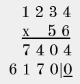
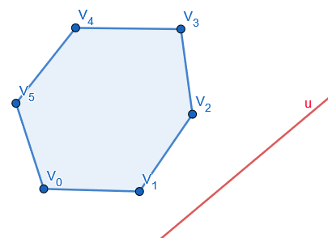
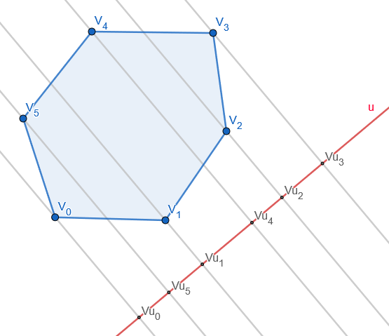
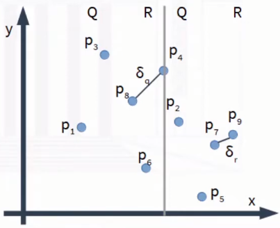
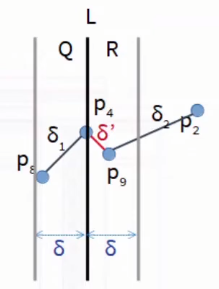
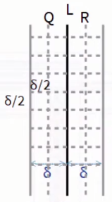
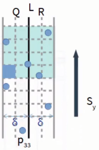

# División y Conquista (Avanzada)

## Índice

- [Técnicas de Diseño](#técnicas-de-diseño)
- [Repaso de D&C y TM](#repaso-de-d&c-y-tm)
- [Ejercicios más avanzados](#ejercicios-más-avanzados)	
  - [Multiplicación de enteros grandes](#multiplicación-de-enteros-grandes)
  - [Obtener extremo de un polígono](#obtener-extremo-de-un-polígono)
  - [Puntos cercanos en un plano](#puntos-cercanos-en-un-plano)
  - [Multiplicación de matrices](#multiplicación-de-matrices)
  - [FFT](#fft)
  - [Conteo de inversiones](#conteo-de-inversiones)

## Técnicas de Diseño

Son metodologías para resolver un problema. En general, si el problema tiene ciertas características, uno sabe si puede utilizar uno u otro. D&C es una de ellas, y hay otras como Greedy, Programación Dinámica, etc.

## Repaso de D&C y TM

Técnica de diseño en la que:

1. Dividimos el problema en subproblemas
2. Resolvemos los subproblemas recursivamente
3. Combinamos las soluciones a cada subproblema.

En general, para analizar la complejidad debemos analizar la ecuación de recurrencia que representa al algoritmo.

### Ejemplos de Algoritmos

1. Búsqueda binaria
2. MergeSort y QuickSort
3. Otros algoritmos de dificultad similar
4. Árboles (incluyendo heaps)

### Ejemplo con MergeSort

```python
def mergesort(arr):
    if len(arr) <= 1:
        return arr
    medio = len(arr) // 2
    izq = mergesort(arr[:medio])
    der = mergesort(arr[medio:])
    return intercalar_ordenado(izq, der)
```

### Teorema Maestro

Dado que calcular la complejidad analíticamente puede resultar innecesariamente complicado, se propone utilizar el siguiente teorema:

Si tenemos un algoritmo cuya ecuación de recurrencia es:

$T(n) = AT(n/B) + O(n^C)$

A: cantidad de llamados recursivos  
B: proporción del tamaño original con el que llamamos recursivamente
$O(n^C)$: costo de partir y juntar (todo lo que no son llamados recursivos)

Si $log_B A < C$ entonces $T(n) = O(n^C)$  
Si $log_B A = C$ entonces $T(n) = O(n^C log\ n)$  
Si $log_B A > C$ entonces $T(n) = O(n^{log_B A})$  

### Condiciones para aplicar el teorema

1. A es natural
2. B es real mayor a 1, y es constante (siempre el mismo)
3. El caso base es constante

### Aplicando TM en MergeSort

$T(n) = 2T(n/2) + O(n)$

donde A = 2, B = 2, C = 1

$log_2 2 = 1 < 1$

Entonces $T(n) = O(n^C log\ n) = O(n\ log\ n)$

### Teorema Maestro general

$T(n) = AT(n/B) + f(n)$

A y B lo mismo que antes, y $f(n)$ es el costo de partir y juntar los resultados.

$f(n) = O(n^C)$, $C < log_B A$ entonces $T(n) = ϴ(n^{log_B A})$  
$f(n) = ϴ(n^Clog^k n)$, $C = log_B A$ entonces $T(n) = ϴ(n^C log^{k+1} n)$  
$f(n) = Ω(n^C)$, $C > log_B A$, $Af(n/B)\leq kf(n)(con k < 1, n\ grande)$ entonces $T(n) = ϴ(f(n))$

**Notas:**  
$O$ es una notación que indica que la función acota superiormente a otra función. Es decir, la función es mayor o igual a otra multiplicada por una constante.  
$ϴ$ es una notación que indica que la función está acotada por una constante multiplicativa. Es decir, la función es igual a otra multiplicada por una constante.  
$Ω$ es una notación que indica que la función acota inferiormente a otra función. Es decir, la función es menor o igual a otra multiplicada por una constante.

#### Ejemplo

$T(n) = 2T(n/2) + log\ n$

$log_B A = 1$

1° caso → $f(n) = O(n)$ → $C = log_B A$ → No aplica, tiene que ser menor.  
2° caso → $f(n) = ϴ(n^0log^1n)$, $C = 0 \neq log_B A$ → No aplica.  
3° caso → $f(n) = Ω(1)$ → $C = 0 < log_B A$ → No aplica, tiene que ser mayor.  
¿Cagamos?  
No! En ningún lado piden que C sea entero, por lo que podemos acotar el logaritmo:  
1° caso → $f(c) = O(n^{0,1})$ → $C < log_B A$ → $T(n) = ϴ(n)$ 

## Ejercicios más avanzados

### Multiplicación de enteros grandes

#### Algoritmo de multiplicación de la primaria



Calculamos productos parciales por cada dígito, vamos multiplicando por la base y luego sumamos.

Agarramos cada m dígito y lo multiplicamos contra los n dígitos, y luego sumamos los n resultados parciales, resultando en O(m*n).

#### Algoritmo mejorado

Escribimos la multiplicación como si tuviéramos trabajando en base 2, y separamos en primera mitad y segunda mitad: $x = x_1 \cdot 2^{n/2} + x_0$, esto hay que realizarlo para ambos números ya que estamos considerando números grandes.

Entonces, $x\cdot y = (x_1 \cdot 2^{n/2} + x_0)(y_1 \cdot 2^{n/2} + y_0)$  
$=x_1 y_1 \cdot 2^n+ (x_1 y_0 + x_0 y_1) \cdot 2^{n/2} + x_0 y_0$

Ahí tenemos 4 multiplicaciones de las subpartes.

Entonces, $T(n) = 4T(n/2) + O(n) = O(n^2)$

C = 1 ya que a la hora de juntar, sumar cuesta O(n).

Podemos mejorar esto teniendo 3 llamados recursivos en lugar de 4.

#### Algoritmo de Karatsuba-Offman

Teniendo en cuenta que $(x_1 + x_0)(y_1 + y_0)= x_1 y_0 + x_0 y_1 + x_1 y_1 + x_0 y_0$  

```python
def multiplicacionBigInt(x, y):
    si largo de x e y son pequeños, devolvemos x*y, sino:
    x = x_1 2^(n/2) + x_0
    y = y_1 2^(n/2) + y_0
    p = multiplicacionBigInt(x_1 + x_0, y_1 + y_0)
    x_0y_0 = multiplicacionBigInt(x_0, y_0)
    x_1y_1 = multiplicacionBigInt(x_1, y_1)
    return x_1y_1 2^n + (p - x_1y_1 - x_0y_0) 2^(n/2) + x_0y_0
```

$T(n) = 3T(n/2) + O(n) = O(n^{log_2 3}) = O(n^1.58)$

### Obtener extremo de un polígono

Tenemos n vértices $V = (V_0, V_1, ..., V_{n-1})$, dispuestos en sentido antihorario.

Problema: Obtener el vértice extremo (ej. el máximo) respecto a un eje (u).



La solución a este problema nos sirve para teoría de juegos, representaciones de imágenes, para algoritmos geométricos, etc.

La solución obvia es hacerlo por fuerza bruta, recorriendo todos los vértices y viendo cuál es el máximo.

#### Algoritmo por D&C

Si sabemos que el polígono es convexo, es decir, todos sus ángulos interiores son menores a 180°, podemos hacerlo por D&C.

Supongamos que el máximo está entre $v_i$ y $v_{i+1}$, incluyendo a todos los vértices entre ellos. Este es nuestro caso inicial. Si lo pensamos bien, esto corresponde a buscar el máximo en un arreglo circular con un 'pico', del siguiente estilo: [3, 6, 8, 10, 5, 2] siendo 10 el pico.  
Esto lo pueden observar en la siguiente imagen recorriendo los vértices del polígono en sentido antihorario(con i incremental) y observando su proyección sobre la recta u.  
Esta propiedad se da debido a que el polígono es convexo, y el 'sentido' respecto el eje u sólo cambia cuando se llega a un vértice extremo.



La propuesta es buscarlo por búsqueda binaria: agarramos el vértice medio, y vemos si es mayor que el anterior y el siguiente. Si es mayor que ambos, entonces es el máximo. Si no, entonces el máximo está en el lado donde el vértice medio es menor que el contiguo.

$T(n) = 2T(n/2) + O(1) = O(log\ n)$

### Puntos cercanos en un plano

Dado n puntos en un plano, buscar la pareja que se encuentre más cercana.

Algoritmo sencillo: comparar todos contra todos, resultando en $O(n^2)$.

#### Algoritmo por D&C

Asumimos que ningún par de puntos tiene la misma coordenada x o y.

Si el problema fuese en 1D, podríamos ordenar los puntos y luego comparar los puntos consecutivos.

Podemos usar nociones de MergeSort, dividiendo el plano en 2 partes.



Primero ordenamos los vértices respecto al eje x, y agarramos el punto del medio(respecto al eje x); lo usamos para dividir el plano en 2 partes, cuyos sets de puntos los llamaremos Q y R respectivamente.

Para Q, calcularemos $Q_x$ y $Q_y$.  
Para R, calcularemos $R_x$ y $R_y$.  
Cada punto q en Q, almacenaremos en qué posición está en $Q_x$ y $Q_y$.  
Cada punto r en R, almacenaremos en qué posición está en $R_x$ y $R_y$.

Esto lo hacemos recursivamente, teniendo como caso base plano con 2 o 3 puntos donde podemos calcular fácilmente la distancia mínima. A la hora de juntar los resultados, llamaremos $\delta$ a la menor entre las 2 distancias mínimas.

El problema es que la distancia mínima puede estar entre un punto en Q y otro en R, por lo que debemos de alguna forma considerar esto.



Llamemos L a la linea vertical que contiene el punto del medio.  
Si la distancia mínima está entre un punto q en Q y un punto r en R, su distancia debe ser menor a $\delta$.  
Esto implica que en dicho caso, tanto q como r deben estar a una distancia menor a $\delta$ desde la linea L.

Llamemos S a los puntos que están a distancia menor a la $\delta$ de la linea L. Estos puntos podemos encontrarlos en O(n) recorriendo todo el conjunto.  
Luego, los ordenamos respecto al eje y.



Esta zona desde L - $\delta$ y L + $\delta$ las dividiremos en celdas de lado = $\delta/2$. Es importante notar que no pueden haber más de un punto en cada celda, ya que si hubiese más de uno, su distancia sería menor a $\delta$ dentro de un mismo plano Q o R y habrían sido elegidos como de distancia mínima al calcular para cada plano individualmente.

Para saber si existe algún par de puntos a distancia menor a $\delta$ en esta zona, podemos determinar para cada punto si existe algún otro punto en celdas cercanas (a no más de $\delta$ de distancia).



Supongamos que consideramos hasta 3 celdas de distancia para simplificar el problema. Si hacemos un recorrido de los puntos en el orden de $S_y$, tendremos que comparar a lo sumo con 15 celdas siguientes hacia arriba(como pueden visualizar en la imagen) dado que ya se habrían hecho comparaciones con los puntos que se encuentran abajo.  
Si no simplificaramos y viésemos caso por caso, podemos hacerlo con 7 celdas ya que no es necesario comparar con las celdas que están a más de $\delta$ de distancia y tampoco con celdas de un mismo plano, pero vamos a obviar esa parte ya que es engorroso y no mejora la complejidad teórica.

En el peor escenario tenemos 15 comparaciones para cada punto en el set entero, por lo tanto combinar el resultado es O(n).

```python
def puntos_cercanos(P):
    construir Px y Py // O(n log n)
    (p0, p1) = puntos_cercanos_rec(Px, Py)

def puntos_cercanos_rec(Px, Py):
    if len(Px) <= 3:
        return puntos_cercanos_brute(Px)
    else:
        Construir Qx, Qy, Rx, Ry // O(n)

        (q0, q1) = puntos_cercanos_rec(Qx, Qy)
        (r0, r1) = puntos_cercanos_rec(Rx, Ry)
    
        delta = min(distancia(q0, q1), distancia(r0, r1))
        x_prima = máxima coordenada x de punto en Q

        L = {{x,y} : x=x_prima}
        S = puntos de P a distancia delta de L

        Construir Sy // O(n)

        Por cada punto s de Sy:
            Computar distancia con próximos 15 puntos de Sy
            sea s, s_prima el par de puntos más cercanos
        
        Si distancia(s, s_prima) < delta:
            retornar (s, s_prima)
        Si distancia(q0, q1) < distancia(r0, r1):
            retornar (q0, q1)
        Sino:
            retornar (r0, r1)
```

$T(n) = 2T(n/2) + O(n) = O(n\ log\ n)$

### Multiplicación de matrices

Un algoritmo sencillo para multiplicar matrices consume $O(n^3)$.

#### Algoritmo por D&C

Primero, podemos dividir las matrices en 4 partes iguales, y luego multiplicarlas recursivamente.

```python
def multiplicacion_matrices(A, B, C, n):
    if n == 1:
        c[0][0] = a[0][0] * b[0][0]
        return
    particionamos A, B y C en matrices de n/2 x n/2
    multiplicacion_matrices(A11, B11, C11, n/2)
    multiplicacion_matrices(A12, B21, C11, n/2)
    multiplicacion_matrices(A11, B12, C12, n/2)
    multiplicacion_matrices(A12, B22, C12, n/2)
    multiplicacion_matrices(A21, B11, C21, n/2)
    multiplicacion_matrices(A22, B21, C21, n/2)
    multiplicacion_matrices(A21, B12, C22, n/2)
    multiplicacion_matrices(A22, B22, C22, n/2)
```

$T(n) = 8T(n/2) + O(1) = O(n^3)$

#### Algoritmo de Strassen

En lugar de hacer 8 llamadas recursivos, hacemos 7, similarmente al algoritmo de Karatsuba-Offman.

$T(n) = 7T(n/2) + O(1) = O(n^{log_2 7}) = O(n^{2.81})$


### FFT

Tenemos 2 vectores A y B, y queremos obtener la convolución entre ambos.

Aplicaciones:
1. Procesamiento de señales
2. Procesamiento del habla
3. Procesamiento de imágenes (Redes Neuronales de Convolución)
4. Machine Learning sobre grafos (Redes Convolucionales de grafos)

La solución trivial resulta en $O(n^2)$ pero podemos hacerlo en $O(n\ log\ n)$ usando D&C.

En este archivo se saltea su solución por su complejidad matemática más allá de la técnica D&C, pero si desea más información, se encuentra detallado en el siguiente video: [Fast Fourier Transform - Ing. Víctor Daniel Podberezki](https://youtu.be/fMfTSsntMls?si=o0Es31_Dk2u3KnQk).

### Conteo de inversiones

Tengo un conjunto de n elementos + 2 arreglos/listas ordenados por diferentes criterios (A y B). Dar una medida de semejanza entre las listas.

Nombramos los elementos en A con 1,2,3,...,n, y B como correspondiente a eso.

¿Qué tan diferente está el orden de B (de forma ascendente) respecto al A?

Dos elementos están invertidos si $b_i > b_j$ con $i < j$.  
La idea es contar cuántas inversiones hay en B respecto a A.

La forma sencilla sería por fuerza bruta resultando en $O(n^2)$.

#### Algoritmo por D&C

Pensemos en MergeSort: agarra dos mitades y al unirlos, los va intercalando según corresponde. En esa etapa de merge, podemos ir contando cuántas veces se tuvo que intercalar, lo que equivaldría a la cantidad de inversiones.

$T(n) = O(n \ log \ n)$ como bien sabemos.

