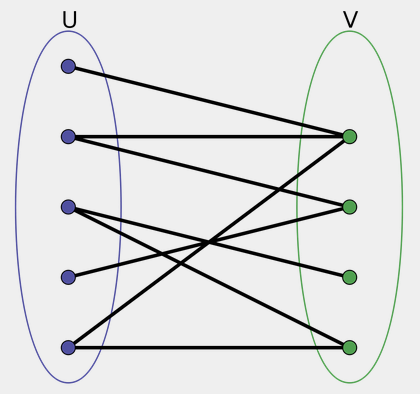
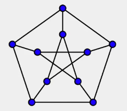
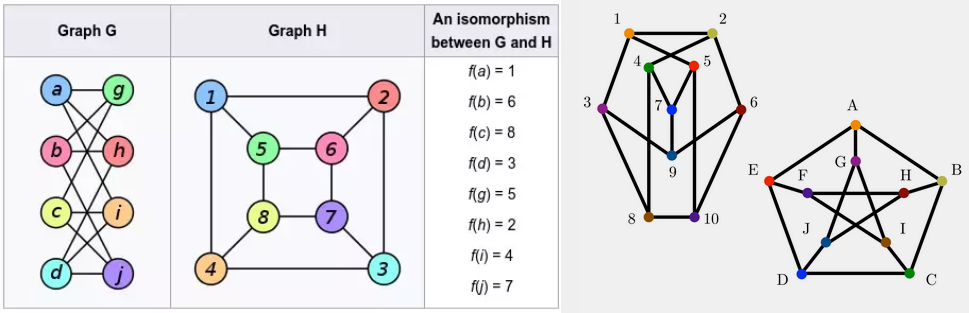

# Repaso de Grafos

## Índice

- [Formas de recorrer un grafo](#formas-de-recorrer-un-grafo)
- [Conectividad en grafos](#conectividad-en-grafos)
- [Orden topológico](#orden-topológico)
- [Grafos bipartitos](#grafos-bipartitos)
- [Puntos de articulación](#puntos-de-articulación)
- [Distancia](#distancia)
- [Árbol de tendido mínimo](#árbol-de-tendido-mínimo)
- [Representación de grafos](#representación-de-grafos)
- [Propiedades matemáticas de la matriz de adyacencia](#propiedades-matemáticas-de-la-matriz-de-adyacencia)
- [Momento teorema - Potenciación de la M.A.](#momento-teorema---potenciación-de-la-m.a.)
- [Propiedad de los Autovectores y Autovalores](#propiedad-de-los-autovectores-y-autovalores)
- [Definición formal de Árbol](#definición-formal-de-árbol)
- [Volviendo a las propiedades de árboles](#volviendo-a-las-propiedades-de-árboles)
- [Handshaking Lemma](#handshaking-lemma)
- [Un grafo es bipartito si y solo si no tiene ciclos de longitud impar](#un-grafo-es-bipartito-si-y-solo-si-no-tiene-ciclos-de-longitud-impar)
- [Cliques](#cliques)
- [Grafos regulares](#grafos-regulares)
- [Grafos cúbicos](#grafos-cúbicos)
- [Grafos Hamiltonianos y Eulerianos](#grafos-hamiltonianos-y-eulerianos)
- [Isomorfismos en Grafos](#isomorfismos-en-grafos)
- [Teorema de isomorfismos](#teorema-de-isomorfismos)

**Grafo:** TDA con entidades (vértices/nodos) y relaciones entre esas entidades(aristas/links).

Tipos de Grafos (relaciones):
- Pesados, no pesados (numérico, flags, valor positivo o negativo, etc.)
- Dirigidos, no dirigidos
- Con bucles o sin bucles
- Simples o compuestos

## Formas de recorrer un grafo

- BFS (Breadth First Search): Recorre por niveles
- DFS (Depth First Search): Recorre por profundidad
- Random Walks: Recorre aleatoriamente
- Dijkstra: Encuentra el camino más corto
- Bellman-Ford: Encuentra el camino más corto con pesos negativos

## Conectividad en grafos

Para grafos no dirigidos:  
- **Conexo**: Existe un camino entre cualquier par de nodos.

Para grafos dirigidos:
- **Fuertemente Conexo**: Existe un camino entre cualquier par de nodos en ambas direcciones.
- **Débilmente Conexo**: Existe un camino entre cualquier par de nodos en una sola dirección.

## Orden topológico

Orden en el que se deben visitar los nodos de un grafo dirigido para que se cumplan las relaciones de precedencia. Por ejemplo, cómo se deben cursar las asignaturas de una carrera.

Se puede obtener con algoritmo de Kahn:

1. Inicialmente, se identifican los vértices que no tienen aristas de entrada, es decir, aquellos que no tienen dependencias.
2. Se elige uno de estos vértices y se agrega a la secuencia topológica.
3. Se eliminan todas las aristas que salen de este vértice.
4. Se repiten los pasos 2 y 3 para los vértices restantes, eligiendo siempre aquellos que no tengan aristas de entrada.
5. El proceso se repite hasta que todos los vértices hayan sido incluidos en la secuencia topológica o hasta que no queden vértices sin procesar.

## Grafos bipartitos

Grafos cuyos nodos se pueden dividir en dos conjuntos disjuntos, de tal forma que no existan aristas entre nodos del mismo conjunto.

Nota: se llama grafo $K_(m,n)$ a un grafo bipartito completo con m nodos en un conjunto y n nodos en el otro. Es decir, un grafo bipartito en el que todos los nodos de un conjunto están conectados con todos los nodos del otro conjunto.

## Puntos de articulación

Nodo cuya eliminación aumenta el número de componentes conexas del grafo.

Se puede obtener con algoritmo de Tarjan:
1. Se realiza un recorrido DFS en el grafo, manteniendo información sobre los tiempos de descubrimiento de cada nodo y los tiempos de finalización de cada nodo.
2. Durante el recorrido DFS, se marca cada vértice con un número de descubrimiento y se mantiene un registro del vértice con el menor número de descubrimiento que se puede alcanzar desde el subárbol del vértice en cuestión.
3. Un vértice es un punto de articulación si y solo si cumple alguna de las siguientes condiciones:
    a. Es la raíz del árbol DFS y tiene al menos dos hijos en el árbol DFS.  
    b. No es la raíz del árbol DFS, pero tiene un hijo v tal que no hay ninguna arista de vuelta desde ningún descendiente de v o de v a algún ancestro de v, cuyo tiempo de descubrimiento sea menor o igual al tiempo de finalización de v.

## Distancia

El algoritmo más rápido para obtener la distancia entre dos nodos para las siguientes condiciones:
- Grafo sin pesos : BFS
- Grafo con pesos positivos : Dijkstra
- Grafo con pesos negativos : Bellman-Ford

## Árbol de tendido mínimo

Árbol obtenido de un grafo no dirigido y conexo, que tiene la menor suma de pesos de las aristas.

Se puede obtener con algoritmo de Kruskal o Prim.

## Representación de grafos

- **Matriz de adyacencia**: Matriz cuadrada de tamaño $n \times n$ donde $n$ es el número de nodos. Si hay una arista entre los nodos $i$ y $j$, la matriz tendrá un 1 en la posición $(i,j)$.
- **Listas de adyacencia(con diccionarios)**: Diccionario donde cada nodo tiene un diccionario con los nodos a los que está conectado y el peso de la arista. El de mejor complejidad teórica.

### Propiedades matemáticas de la matriz de adyacencia

- Es cuadrada (VxV).
- Si el grafo es no dirigido, es simétrica.
- Si no hay bucles, la diagonal principal es 0.

### Momento teorema - Potenciación de la M.A.

Siendo A la matriz de adyacencia de un grafo G, la matriz $A^n_{ij}$ contiene la cantidad de caminos de longitud n entre los vértices i y j.

**Demostración por inducción:**
Para $n=1$, la matriz nos indica si están conectados o no.  
Supongamos que la afirmación es verdadera para k=n.  
Si la matriz $F^n$ nos indica la cantidad de caminos de longitud n entre los vértices i y j, $F^n = A^n$.
Podemos expresar un camino de longitud n+1 desde i hasta j como los caminos de largo n de i a k y luego un camino de largo 1 desde k hasta j.  
Entonces, la cantidad de caminos de largo n+1 de i a j es la suma de la cantidad de caminos de largo n de i a k multiplicado por la cantidad de formas que hay para llegar de k a j en un paso.  
Por lo tanto, $F^{n+1}_{ij} = \sum_{v} A_{kj}F^n_{ik} = \sum_{v} A_{kj}A^n_{ik} = A^{n+1}_ij$.  
La última igualdad es por la definición de la multiplicación de matrices. Es redundante demostrarlo, créanme.

### Propiedad de los Autovectores y Autovalores

Los autovectores y autovalores de la matriz de adyacencia nos permiten obtener:
- Una medida de centralidad de los nodos
- Una forma de clusterizar (comunidades)

## Definición formal de Árbol

Un **árbol** es un grafo no dirigido tal que:  
Para todo v,w en V, hay un único camino entre v y w.

Esto implica las siguientes 3 propiedades:
- El árbol es conexo: si no fuera conexo no existiría camino para todo v y w.
- El árbol es acíclico: si hubiera ciclo, habría más de un camino entre v y w.
- El árbol tiene n-1 aristas: partiendo de que esto cumple para n=1, si consideramos un árbol con n+1 nodos, al eliminar una hoja en ello, se obtiene un árbol con n nodos y n-1 aristas.

### Teorema

Todo árbol de al menos dos vértices tiene al menos 2 vértices de grado 1.

**Demostración por el absurdo:** Supongamos que un árbol tiene menos de 2 vértices de grado 1.  
¿Qué pasa si un árbol tiene 0 vértices de grado 1? Es imposible, porque no habría hojas, tendría que tener al menos 1.  
Hacemos un recorrido DFS desde esa única hoja, que necesariamente termina en un vértice de grado 1.  
Caso contrario, ese vértice final tiene que tener una arista a un vértice ya visitado, es decir, existe más de un camino entre ese par de vértices.

## Volviendo a las propiedades de árboles

- El árbol es conexo.
- El árbol es acíclico.
- El árbol tiene n-1 aristas.

Si un grafo cumple 2 de esas 3 propiedades, cumple la tercera y es un árbol.

1. G es conexo y acíclico.  
**Demostración por inducción:**
Sea T un grafo con V vértices.  
Para V=1, no hay aristas, cumple las 3 propiedades.  
Supongamos que es cierto para V vértices.  
Todo grafo conexo y acíclico de al menos 2 vértices tiene al menos 2 vértices de grado 1, por lo mismo que demostramos antes.  
Para T con V+1, como tiene al menos 2 vértices, al eliminar un vértice de grado 1 obtenemos un grafo conexo y acíclico con V-1 vértices y V-2 aristas por la hipótesis de inducción.

2. G es acíclico y tiene n-1 aristas.  
**Demostración por método directo:**
Veamos cuántas K componentes conexas tenemos.  
Cada componente conexa es acíclica (por hipótesis) y debe ser conexa (por definición).
Entonces, como acabamos de probar el ítem 1,
$E_{c_i} = V_{c_i}-1$.  
Siendo K el número de componentes conexas,  
$E = \sum_{K} E_{c_i} = \sum_{K} (V_{c_i} - 1) = V - K = V - 1$.
$K = 1$

3. G es conexo y tiene n-1 aristas.
**Demostración por método directo:**  
G es conexo por hipótesis.  
Supongamos que G tiene t ciclos.  
Sacando una arista en cada ciclo, podemos obtener un grafo acíclico y conexo.  
Este grafo es un árbol por lo demostrado en el ítem 1.  
$E_{G'} = V_{G'}-1$  
$E_{G} = E_{G'} + t = V_{G'} - 1 + t = V_{G} - 1 + t $ dado que no se eliminaron vértices.
Por lo tanto, $t = 0$.

## Handshaking Lemma

En todo grafo no dirigido, la cantidad de vértices con un grado impar, es par.

**Demostración por método directo:**  
$\sum_{V} grado(v) = 2E$ ya que cada arista contribuye 2 al grado de los vértices que conecta.
$\sum_{V} grado(v) = \sum_{V_{par}} grado(v) + \sum_{V_{impar}} grado(v) = 2E$  
$\sum_{V_{impar}} grado(v) = 2E - \sum_{V_{par}} grado(v)$, donde 2E es par y la sumatoria de los grados de los vértices pares también, por ser sumatoria de números pares.  
Número par - número par = número par.

## Un grafo es bipartito si y solo si no tiene ciclos de longitud impar

Si es bipartito, no tiene ciclos impares.  
**Demostración por método directo:**  
Si el grafo es bipartito, cualquier camino que vaya de una subcomponente otra vez a la misma tiene que ser de longitud par.

Si todos los ciclos son de longitud par, el grafo es bipartito.  
**Demostración por método directo:**  
Teniendo cualquier vértice $v_0$, tomemos la distancia en aristas de $v_0$ a todos los demás vértices. Pintamos todos los vértices a distancia de par de rojo y los de distancia impar de azul. Si hay arista a dos vértices de mismo color, habría un ciclo impar; esto no puede pasar, terminamos separando en 2 subconjuntos y el grafo es bipartito.

## Cliques

Un **clique** es un subgrafo completo (todos los vértices están conectados entre sí).

Un 3-clique es un triángulo, un 4-clique es un cuadrado, etc.

## Grafos regulares

Un **grafo d-regular** es un grafo en el que todos los vértices tienen grado d. No implica que el grafo sea conexo.

Propiedades de un grafo d-regular:
1. El vector unitario es autovector de la matriz de adyacencia, cuyo autovalor es d, y es el autovalor más grande (se usa esta noción para clusterizar).
2. Un grafo completo es un grafo regular.
3. Teorema Nash-Williams: todo grafo k-regular en un grafo con 2k+1 vértices tiene un ciclo hamiltoniano (camino cerrado que pasa por todos los vértices una vez y solo una vez, terminando en el mismo vértice).

## Grafos cúbicos

Un **grafo cúbico** es un grafo 3-regular.

## Grafos Hamiltonianos y Eulerianos

**Camino de Euler:** Un camino que pasa por todas las aristas

**Ciclo de Euler:** Idem pero termina en el mismo vértice.

Un grafo tiene un ciclo de Euler si y solo si todos los vértices son de grado par.  
Un grafo tiene camino de Euler si y solo si tiene 0 o 2 vértices de grado impar.

**Camino Hamiltoniano:** Un camino que pasa por todos los vértices una única vez.

**Ciclo Hamiltoniano:** Idem pero termina en el mismo vértice.

## Isomorfismos en Grafos

Se dicen que dos grafos son **isomorfos** si podemos renombrar los vértices de uno para que sea igual al otro; es decir, si son el mismo grafo pero con visualización y nombres diferentes.

## Teorema de isomorfismos

G y H son dos grafos con matrices de adyacencia A y B, respectivamente.

G y H son isomorfos si y solo si existe una matriz P tal que $B = PAP^{-1}$.
